# Media Basket

**All your media accounts in one basket.**

Media Basket is a unified, multi-tenant social media management platform that collects every media account you manage into a single workspace. Modeled after a Windows Explorer tree view, each node in the tree represents one connected media service — Facebook, WhatsApp, YouTube, and more — so you can moderate, publish, analyze, and automate across all of them from one place.

> **Copyright © 2024-2026 SowinySoft. All rights reserved.**
> This is proprietary software. See [LICENSE](LICENSE) and [COPYRIGHT](COPYRIGHT) for usage terms.

---

## Table of Contents

- [Overview](#overview)
- [Key Features](#key-features)
- [Feature Matrix](#feature-matrix)
- [Architecture](#architecture)
- [Tech Stack](#tech-stack)
- [Repository Layout](#repository-layout)
- [Supported Connectors](#supported-connectors)
- [Workflow Automation](#workflow-automation)
- [ML Pipeline](#ml-pipeline)
- [Security & Multi-Tenancy](#security--multi-tenancy)
- [Observability](#observability)
- [Quick Start](#quick-start)
- [Installation](#installation)
- [Configuration](#configuration)
- [API Reference](#api-reference)
- [Database Schema](#database-schema)
- [Deployment](#deployment)
- [Testing](#testing)
- [CI/CD](#cicd)
- [Troubleshooting](#troubleshooting)
- [Contributing](#contributing)
- [Roadmap](#roadmap)
- [Documentation](#documentation)
- [License](#license)

---

## Overview

Managing multiple social media accounts means juggling a dozen dashboards, credential stores, and moderation queues. Media Basket consolidates everything:

- **One tree** for all your connected services, styled like a file explorer.
- **One inbox** of content and comments from every platform.
- **One moderation queue** backed by ML classification.
- **One scheduler** for cross-platform publishing.
- **One workflow engine** to automate the boring parts.

The platform is **SaaS-ready from day one**: organizations, roles (Owner / Admin / Member / Viewer), Row-Level Security (RLS), audit logging, billing endpoints, and GDPR export are all built in.

### Core Metaphor

```
📦 Media Basket  (your workspace)
└── 🗂️ Organization
    ├── 📁 YouTube ──────── Moderator, analytics, content
    ├── 📁 WhatsApp ─────── Inbox, replies, webhooks
    ├── 📁 Reddit ───────── Approve / remove / comment
    ├── 📁 X (Twitter) ──── Engagement, sentiment alerts
    ├── 📁 Instagram ────── Content, suggestions
    └── 📁 Telegram ─────── Broadcast pipeline
```

### Personas

| Persona | Use Case |
|---------|----------|
| **Social Media Manager** | Moderate comments, reply, schedule posts across brands |
| **Community Moderator** | Flag spam/toxicity, run approval workflows |
| **Agency** | Multi-client orgs with role-based access for team members |
| **Content Strategist** | Analytics, ROI tracking, competitor watch |
| **Ops / Admin** | Billing, retention, backup, plugin lifecycle |

### Project Stats

| Dimension | Value |
|-----------|-------|
| Connectors | 15 |
| API Routers | ~50 |
| Database Migrations | 12 |
| Frontend Pages | 20+ |
| React Components | 50+ |
| Workflow Templates | 6 |
| ML Signals | 5 (sentiment, spam, toxicity, tags, language) |
| RBAC Roles | 4 (Owner / Admin / Member / Viewer) |

---

## Key Features

### Platform & Multi-Tenancy

- Organizations with full **RBAC** — `Owner`, `Admin`, `Member`, `Viewer`
- **Row-Level Security (RLS)** enforced at the database layer for tenant isolation
- Member invitations & role management
- Organization switcher (users can belong to multiple orgs)
- Audit logging (`pgaudit` + application-level) with searchable history
- **Stripe billing** endpoints — Free / Pro / Enterprise tiers
- **GDPR**: full data export, account deletion
- **Data retention policies** per org (auto-purge rules)
- **Alerts & alerting rules** — threshold-based notifications
- Admin console for platform-level management

### Connectors (15+ services)

- **Fully integrated** connectors: YouTube, Reddit, WhatsApp Business, Telegram, Instagram, X/Twitter, Facebook, LinkedIn, TikTok, Discord, Slack, Mastodon, Pinterest, Snapchat, Bluesky
- OAuth 2.0 flows with credential storage in the secrets vault
- Poll-based ingestion (Celery Beat) and/or webhook-driven ingestion per service
- Credentials stored encrypted, never in plaintext
- Connector registry with tiered integration levels (Full / Pipeline)

### Moderation & Content

- **Unified inbox** across all connected services
- Comment threading & replies from one queue
- **Bulk actions** — approve, remove, archive in batches
- **Approval workflows** with multi-step sign-off
- Internal team comments & task assignment
- Content calendar & scheduler for cross-platform publishing
- Content templates & suggestions (AI-assisted)

### AI / ML Pipeline

- **Sentiment analysis** — VADER / DistilBERT
- **Spam detection** — TF-IDF + Logistic Regression
- **Toxicity detection** — Toxic-BERT (optional GPU)
- **Auto-tagging** — spaCy NER
- **Language detection** — fastText
- ML signals feed directly into workflow conditions (e.g. `toxicity > 0.7`)

### Workflow Automation

- Event-driven **visual workflow builder**
- Triggers: `content.new`, `content.flagged`, `schedule` (cron), `webhook`, `manual`
- Step types: **condition, action, delay, branch**
- 6 pre-built templates (auto-flag toxic, negative sentiment alert, spam filter, cross-platform publisher, etc.)
- Execution history with per-step results

### Marketing & Analytics

- Customizable **dashboard builder** (drag & drop)
- **ROI tracking** per campaign / service
- **Competitor tracking**
- **A/B testing** of posts
- **Sentiment alerts** & anomaly detection
- Calendar view, activity feed, analytics per service

### Extensibility

- **Plugin SDK** — build connectors in Python (`ConnectorPlugin` ABC)
- **Plugin marketplace** with sandboxed plugin execution
- Plugin validation & sandboxing for third-party code
- Webhook builder (no-code outbound webhooks)

### Operations

- Health check dashboard
- Prometheus **metrics** endpoint (`/metrics`)
- OpenTelemetry tracing
- Structured logging (`structlog`) with request correlation IDs
- Rate limiting middleware
- Backup / restore scripts
- Retry + dead-letter queue for Celery tasks
- Search across content (full-text + filters)

---

## Feature Matrix

| Area | Feature | Backend Route | Frontend Page/Component |
|------|---------|---------------|-------------------------|
| **Auth** | Register / login / refresh | `auth.py` | `login/page.tsx` |
| **Orgs** | CRUD, org switcher | `org.py` | `settings/page.tsx` |
| **Members** | Invite, roles, remove | `members.py` | `settings/members/page.tsx` |
| **Services** | Connect / disconnect | `services.py` | `tree/page.tsx`, `settings/services` |
| **OAuth** | Provider callback flows | `oauth.py` | `AddServiceModal.tsx` |
| **Content** | List, detail, filter | `content.py` | `content/page.tsx`, `ContentDetail.tsx` |
| **Moderation** | Queue, actions | `moderation.py` | `moderate/page.tsx` |
| **Comments** | Thread, reply, internal | `comments.py` | `InternalComments.tsx` |
| **Bulk** | Approve/remove/archive | `bulk.py` | `BulkActions.tsx` |
| **Approval** | Multi-step sign-off | `approval.py` | `ApprovalWorkflow.tsx` |
| **Tasks** | Assignment, tracking | `tasks.py` | `TaskAssignment.tsx` |
| **Calendar** | Schedule, publish | `calendar.py` | `CalendarView.tsx` |
| **Templates** | Content templates | `templates.py` | `TemplateManager.tsx` |
| **Suggestions** | AI content ideas | `suggestions.py` | `ContentSuggestions.tsx` |
| **Workflows** | Builder, engine, run | `workflows.py` | `workflows/page.tsx` |
| **Webhooks** | No-code outbound | `webhooks_builder.py` | `WebhookBuilder.tsx` |
| **Search** | Full-text + filters | `search.py` | `tree/page.tsx` (Ctrl+F) |
| **Analytics** | Aggregates, per-service | `analytics.py` | `analytics/page.tsx` |
| **ROI** | Campaign ROI | `roi.py` | `ROITracking.tsx` |
| **Competitors** | Watch list | `competitors.py` | `CompetitorList.tsx` |
| **A/B Tests** | Experiment runner | `ab_testing.py` | `ABTestManager.tsx` |
| **Dashboards** | Drag-drop builder | `dashboards.py` | `DashboardBuilder.tsx` |
| **Alerts** | Sentiment thresholds | `alerts.py` | `SentimentAlerts.tsx` |
| **Alerting** | Rules engine | `alerting.py` | `settings/alerting/page.tsx` |
| **Inbox** | Notifications | `inbox.py` | `inbox/page.tsx` |
| **Audit** | Searchable trail | `audit.py`, `pgaudit.py` | `AuditLog.tsx` |
| **GDPR** | Export / delete | `gdpr.py` | `privacy/page.tsx` |
| **Retention** | Auto-purge | `data_retention.py` | `settings/retention/page.tsx` |
| **Backup** | Backup scheduling | `backup.sh` | `settings/backup/page.tsx` |
| **Billing** | Stripe tiers | `billing.py` | `settings/billing/page.tsx` |
| **Plugins** | Lifecycle, sandbox | `plugins.py` | `settings/plugins/page.tsx` |
| **Marketplace** | Browse / install | `marketplace.py` | `marketplace/page.tsx` |
| **Admin** | Platform console | `admin.py` | `admin/page.tsx` |
| **Scheduler** | Cron jobs | `scheduler.py` | — (Celery Beat) |
| **WebSocket** | Realtime events | `websocket.py` | `store.ts` subscriptions |
| **Export** | Data export | `export.py` | — |
| **Activity** | Feed | `activity.py` | `ActivityFeed.tsx` |
| **Health** | Liveness/readiness | `health.py` | — |
| **Metrics** | Prometheus | `main.py` `/metrics` | Grafana |

---

## Architecture

### High-Level System Diagram

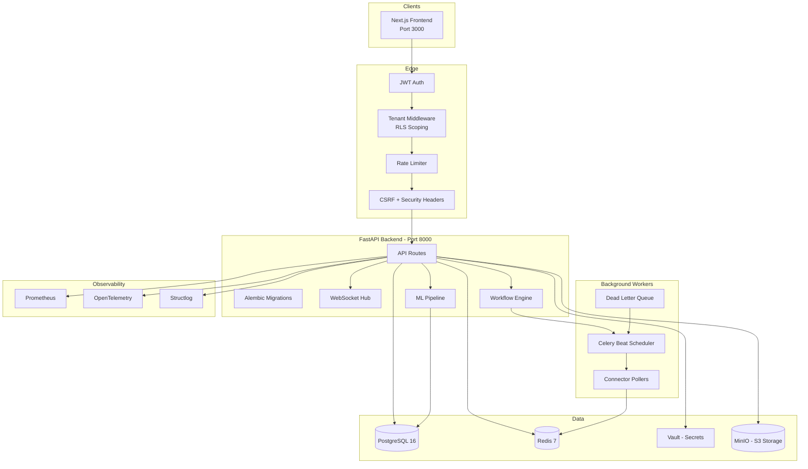

### Backend Component Breakdown

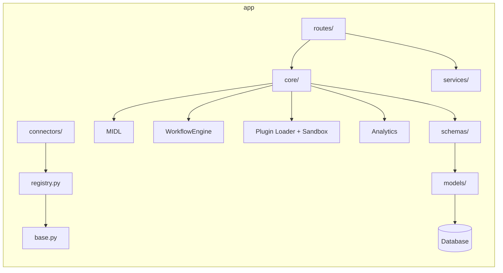

### Request Lifecycle (Sequence Diagram)

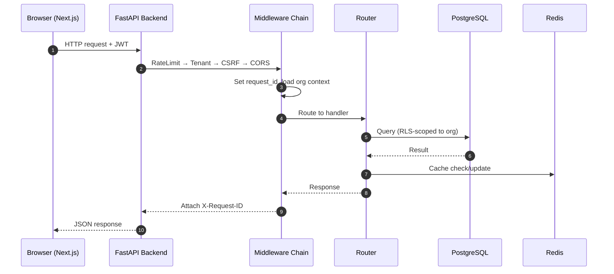

### OAuth Connector Flow (Sequence Diagram)

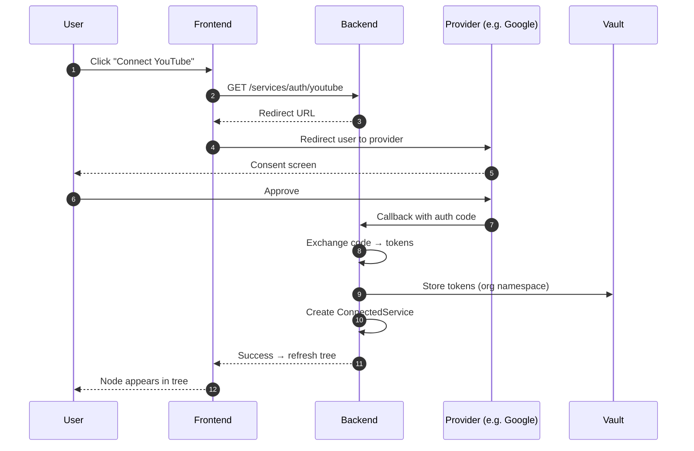

### Content Ingestion Pipeline

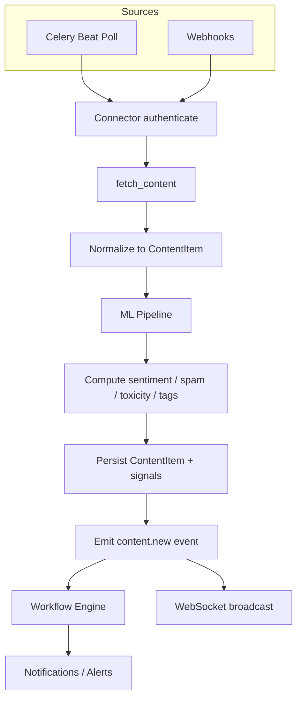

### Moderation Decision Flow

```mermaid
flowchart TB
    ITEM[New content item] --> ML[ML signals]
    ML --> T{[toxicity > 0.7?]}
    T -- yes --> FLAG[Flag + notify]
    T -- no --> S{[spam_score > 0.8?]}
    S -- yes --> QUAR[Quarantine]
    S -- no --> APP[Auto-approve]
    FLAG --> REVIEW[Human review queue]
    QUAR --> REVIEW
    REVIEW --> DECIDE{Decision}
    DECIDE -- approve --> PUBLISH[Approve / publish]
    DECIDE -- remove --> REMOVE[Remove / hide]
    DECIDE -- reply --> REPLY[Draft reply]
    PUBLISH --> LOG[Audit log]
    REMOVE --> LOG
    REPLY --> LOG
```

### Workflow Execution (Sequence Diagram)

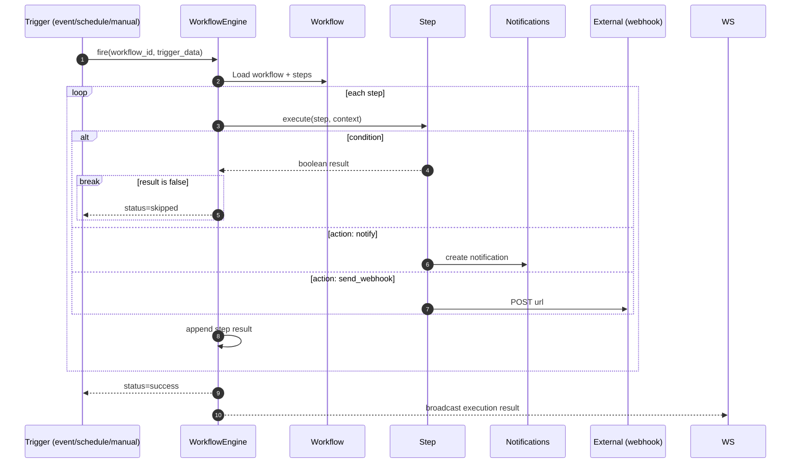

### Content Lifecycle (State Diagram)

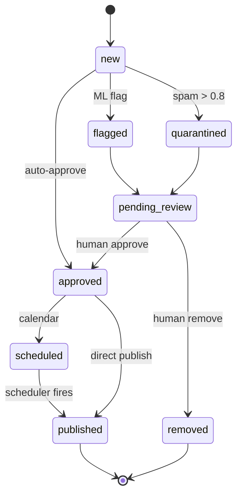

### Workflow Execution States (State Diagram)

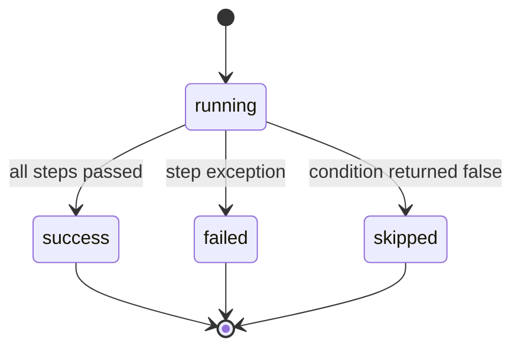

### Deployment Topology (Docker Compose)

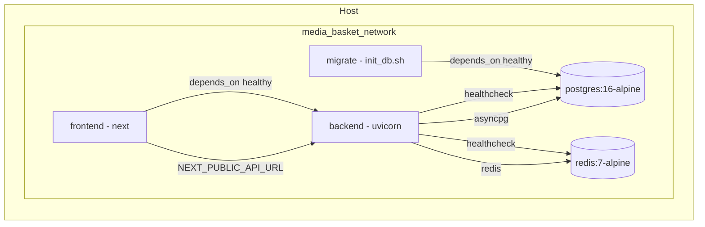

### Kubernetes Architecture (Helm Chart)

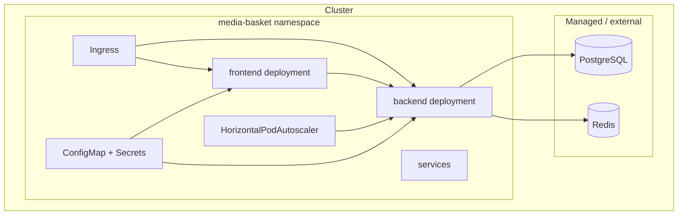

---

## Tech Stack

| Layer | Technology |
|-------|-----------|
| **Frontend** | Next.js 14 (App Router), React 18, TypeScript |
| **Tree View** | `react-arborist` |
| **UI** | Tailwind CSS, Radix UI, `lucide-react` icons |
| **State** | Zustand |
| **Backend** | FastAPI (Python 3.12+) |
| **ORM** | SQLAlchemy 2.0 (async) + Alembic |
| **Database** | PostgreSQL 16 (asyncpg) |
| **Queue** | Celery 5 + Redis broker + Beat scheduler |
| **Cache** | Redis 7 |
| **ML** | scikit-learn, spaCy, HuggingFace, ONNX Runtime |
| **Secrets** | HashiCorp Vault |
| **Storage** | MinIO (S3-compatible) |
| **Auth** | JWT (python-jose) + passlib/bcrypt |
| **Logging** | `structlog` |
| **Tracing** | OpenTelemetry |
| **Metrics** | Prometheus client |
| **Billing** | Stripe |
| **Testing** | pytest (backend), Playwright (E2E) |
| **Container** | Docker + Docker Compose, Podman-compose |
| **Orchestration** | Kubernetes (Helm chart) |

---

## Repository Layout

```
Media_Basket/
├── backend/              # FastAPI application
│   ├── app/
│   │   ├── connectors/   # 15+ platform connectors
│   │   ├── core/         # config, db, ml, security, engine
│   │   ├── middleware/   # tenant, csrf, rate-limit
│   │   ├── ml/           # ML pipeline
│   │   ├── models/       # ORM models
│   │   ├── routes/       # ~50 API routers
│   │   ├── schemas/      # Pydantic schemas
│   │   └── services/     # business logic
│   ├── alembic/          # 12 migrations
│   ├── tests/            # backend tests
│   └── Dockerfile
├── frontend/             # Next.js app
│   ├── src/
│   │   ├── app/          # pages (tree, inbox, workflows, settings...)
│   │   ├── components/   # UI components
│   │   ├── lib/          # api client, store
│   │   └── sdk/          # TS connector SDK
│   ├── tests/            # Playwright E2E
│   └── Dockerfile
├── k8s/                  # Helm chart + templates
├── ml/                   # ML training & serving
├── sdk/                  # Plugin SDK
├── scripts/              # ops scripts (backup, restore, init_db)
├── docker-compose.yml
├── podman-compose.yml
├── .env.example          # all config keys
├── ARCHITECTURE.md       # full system design (frozen)
├── ROADMAP.md            # implementation plan
└── AGENT.md              # agent memory / project context
```

### Backend Directory Detail

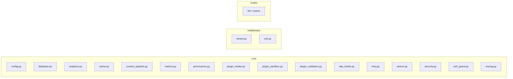

### Frontend Directory Detail

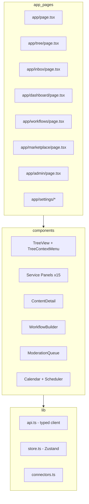

---

## Supported Connectors

| # | Service | Integration Tier | Auth | Ingestion | Write Capabilities |
|---|---------|------------------|------|-----------|--------------------|
| 1 | YouTube | Full | OAuth 2.0 | Poll (Celery Beat) | Comment moderation |
| 2 | Reddit | Full | OAuth 2.0 | Poll (Celery Beat) | Approve / remove / comment |
| 3 | WhatsApp Business | Full | OAuth 2.0 (Meta) | Webhook-driven | Send messages / replies |
| 4 | Telegram | Full | Bot Token | Webhook / Poll | Send / broadcast |
| 5 | Instagram | Full | OAuth 2.0 | Poll | Content & engagement |
| 6 | X (Twitter) | Full | OAuth 2.0 | Poll | Engage / publish |
| 7 | Facebook | Full | OAuth 2.0 | Poll | Content & engagement |
| 8 | LinkedIn | Full | OAuth 2.0 | Poll | Content & engagement |
| 9 | TikTok | Full | OAuth 2.0 | Poll | Content & engagement |
| 10 | Discord | Full | Bot Token | Poll | Send / moderate |
| 11 | Slack | Full | OAuth 2.0 | Webhook | Send / reply |
| 12 | Mastodon | Full | OAuth 2.0 | Poll | Post / engage |
| 13 | Pinterest | Full | OAuth 2.0 | Poll | Content |
| 14 | Snapchat | Full | OAuth 2.0 | Poll | Content |
| 15 | Bluesky | Full | App Password | Poll | Post / engage |

Every connector implements the shared `ConnectorPlugin` interface, so new services plug in with minimal effort — or via a third-party plugin from the marketplace.

### Connector Interface

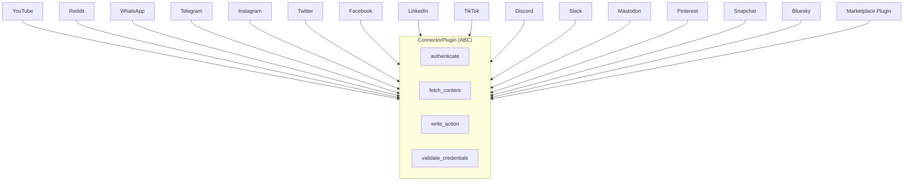

---

## Workflow Automation

Workflows are **event-driven pipelines** that execute a sequence of steps (conditions, actions, delays, branches) when triggered.

```
┌─────────────┐     ┌─────────────┐     ┌─────────────┐     ┌─────────────┐
│   TRIGGER   │────▶│  CONDITION  │────▶│   ACTION    │────▶│   OUTPUT    │
└─────────────┘     └─────────────┘     └─────────────┘     └─────────────┘
   content.new          sentiment           notify               success
   content.flagged      spam_score          flag_content         failed
   schedule             toxicity > 0.7      send_webhook         skipped
   webhook              likes > 100         log
   manual               approved == true    update_status
```

### Trigger → Step Pipeline

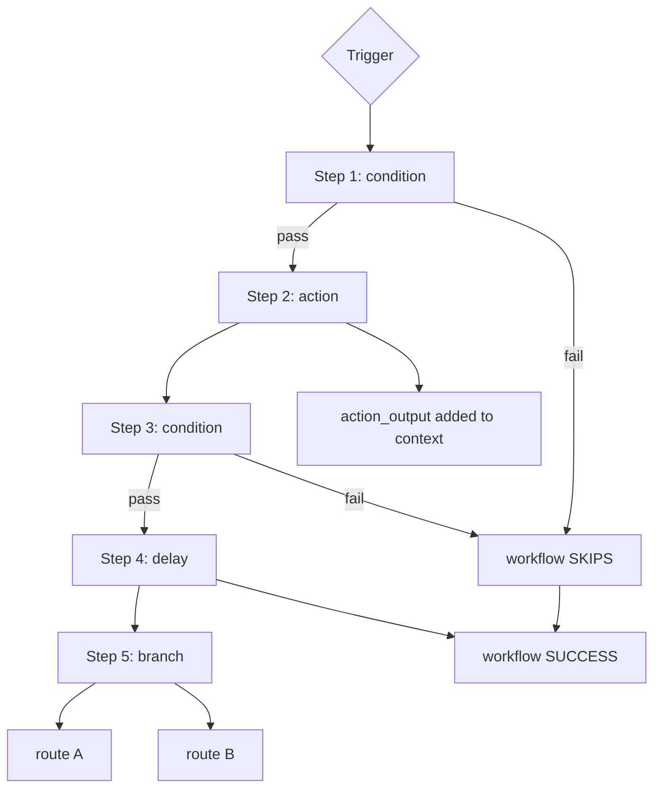

### Triggers

| Trigger | Config | Fires When |
|---------|--------|------------|
| `content.new` | `{connector_type?: string}` | New content ingested |
| `content.flagged` | `{reason?: string}` | Content flagged by moderation / ML |
| `schedule` | `{cron: "0 9 * * *"}` | Cron schedule (Celery Beat) |
| `webhook` | `{secret?: string}` | External webhook POST |
| `manual` | `{}` | User clicks "Execute" in UI or calls API |

### Step Types

| Step | Purpose |
|------|---------|
| **Condition** | Evaluate a boolean expression. Operators: `equals`, `not_equals`, `contains`, `greater_than`, `less_than`, `in`, `exists`, `not_exists` |
| **Action** | Execute a side effect: `notify`, `flag_content`, `update_status`, `send_webhook`, `log` |
| **Delay** | Pause execution for a duration |
| **Branch** | Route execution based on a field value |

### Pre-Built Templates

| Template | Trigger | Steps | Purpose |
|----------|---------|-------|---------|
| Auto-Flag Toxic | content.new | 2 | Flag content with toxicity > 0.7 |
| Negative Sentiment Alert | content.new | 1 | Notify on negative sentiment |
| High Engagement Auto-Share | content.new | 2 | Auto-schedule high-engagement posts |
| Spam Content Filter | content.new | 2 | Quarantine spam (score > 0.8) |
| Daily Digest Notification | schedule | 1 | Daily summary at 9 AM |
| Cross-Platform Publisher | manual | 2 | Publish approved content via webhook |

### Example: Auto-Flag Toxic Workflow

```json
{
  "name": "Auto-Flag Toxic",
  "trigger": { "type": "content.new" },
  "steps": [
    {
      "type": "condition",
      "config": { "field": "toxicity_score", "operator": "greater_than", "value": 0.7 }
    },
    {
      "type": "action",
      "config": { "action_type": "flag_content", "reasons": ["toxic"] }
    }
  ]
}
```

### Example: Cross-Platform Publisher

```json
{
  "name": "Cross-Platform Publisher",
  "trigger": { "type": "manual" },
  "steps": [
    {
      "type": "condition",
      "config": { "field": "approval_status", "operator": "equals", "value": "approved" }
    },
    {
      "type": "action",
      "config": {
        "action_type": "send_webhook",
        "url": "https://hooks.example.com/publish"
      }
    },
    {
      "type": "action",
      "config": { "action_type": "update_status", "new_status": "published" }
    }
  ]
}
```

### Execution States

| State | Meaning |
|-------|---------|
| `running` | Currently executing |
| `success` | All steps completed |
| `failed` | A step threw an exception |
| `skipped` | A condition step returned false |

### Workflow Integration Points

| System | Integration |
|--------|-------------|
| **Content Pipeline** | Trigger on `content.new` after ingestion |
| **ML Pipeline** | Access `sentiment`, `spam_score`, `toxicity_score` in conditions |
| **Notifications** | `notify` action creates in-app notifications |
| **Moderation** | `flag_content` action updates ContentMetadata |
| **Scheduler** | `schedule` trigger type with cron expressions |
| **Webhooks** | `send_webhook` action POSTs to external URLs |
| **WebSocket** | Execution results broadcast to connected clients |

> Full documentation: [`workflow.md`](workflow.md)

---

## ML Pipeline

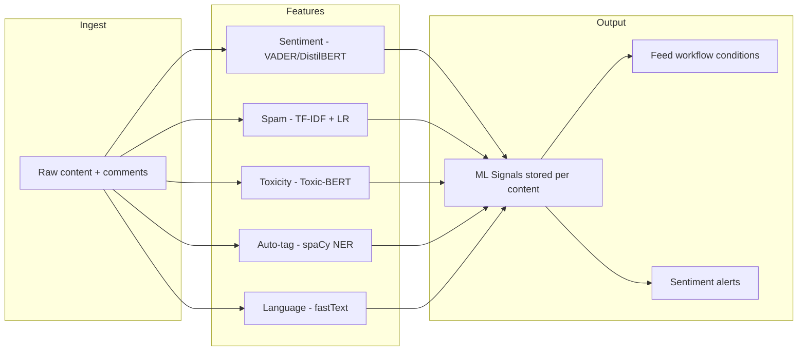

| Signal | Model | Purpose |
|--------|-------|---------|
| Sentiment | VADER / DistilBERT | Positive / neutral / negative |
| Spam score | TF-IDF + Logistic Regression | Spam probability |
| Toxicity | Toxic-BERT | Toxic content flag (GPU optional) |
| Tags | spaCy NER | Auto-tag entities & topics |
| Language | fastText | Detect language |

---

## Security & Multi-Tenancy

### Security Layers

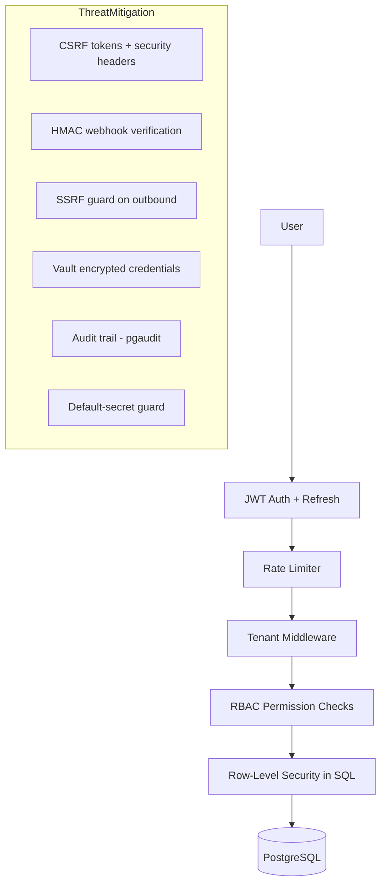

- **JWT auth** (access + refresh tokens), bcrypt password hashing
- **Row-Level Security (RLS)** — hard tenant isolation at the database
- **RBAC** — Owner / Admin / Member / Viewer, enforced per-route via permission dependencies
- **Encrypted credentials** — stored in HashiCorp Vault, never in the DB in plaintext
- **CSRF protection** middleware + security headers
- **Rate limiting** middleware (per-org, per-route)
- **Webhook signature verification** (HMAC) to prevent spoofed callbacks
- **SSRF guard** on plugin webhooks / outbound requests
- **Audit logging** — `pgaudit` + app-level trails
- **Structured logging** with correlation IDs for incident tracing
- Startup guard warns if default secrets are used in production
- Production disables `/docs` & `/redoc` automatically

### RBAC Permission Matrix

| Capability | Owner | Admin | Member | Viewer |
|------------|:-----:|:-----:|:------:|:------:|
| View content & analytics | ✅ | ✅ | ✅ | ✅ |
| Moderate / reply | ✅ | ✅ | ✅ | ❌ |
| Connect / disconnect services | ✅ | ✅ | ❌ | ❌ |
| Manage members & roles | ✅ | ✅ | ❌ | ❌ |
| Billing & plan changes | ✅ | ❌ | ❌ | ❌ |
| Data retention / GDPR | ✅ | ✅ | ❌ | ❌ |
| Workflow create/update/delete | ✅ | ✅ | ❌ | ❌ |
| Plugin install / uninstall | ✅ | ✅ | ❌ | ❌ |
| Platform admin | ✅ | ❌ | ❌ | ❌ |

---

## Observability

### Telemetry Stack

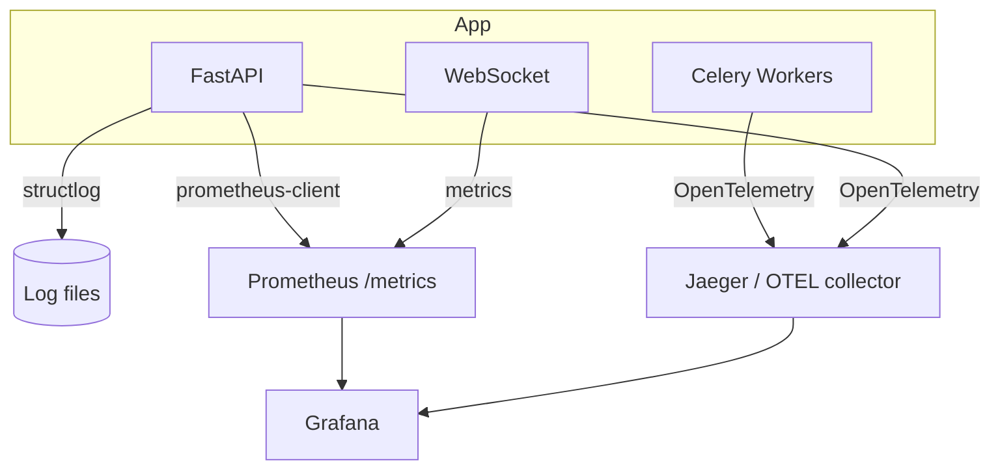

- **Metrics** — `GET /metrics` exposes HTTP request counts, latencies, and worker health for Prometheus scraping. Paths are normalized to avoid high-cardinality labels.
- **Tracing** — OpenTelemetry instrumentation with automatic FastAPI wiring (graceful fallback if the collector is absent).
- **Logging** — `structlog` structured logs with `request_id` correlation IDs on every request.
- **Health** — `/api/v1/health` liveness endpoint used by Compose/K8s healthchecks.

---

## Quick Start

### Docker Compose (recommended)

```bash
git clone https://github.com/SowinySoft/Media-Basket
cd Media_Basket

# 1. Create environment file
cp .env.example .env

# 2. Start everything (Postgres, Redis, migrate, backend, frontend)
docker compose up --build

# 3. Open the app
open http://localhost:3000
```

### Podman

```bash
podman-compose -f podman-compose.yml up --build
```

### Ports

| Service | URL | Credentials |
|---------|-----|-------------|
| Frontend | http://localhost:3000 | — |
| API | http://localhost:3001 | — |
| API (Docker) | http://localhost:8000 | — |
| Swagger UI | http://localhost:8000/docs | (DEBUG only) |
| Prometheus | http://localhost:8000/metrics | — |
| Postgres | `localhost:5432` | `postgres` / `postgres` |
| Redis | `localhost:6379` | — |
| Vault UI | http://localhost:8200/ui | `dev-token-root` |
| MinIO Console | http://localhost:9001 | `minioadmin` / `minioadmin` |

### First-Time Setup

1. Open http://localhost:3000
2. Click **Sign Up** and create your account (becomes org Owner)
3. Go to **Settings → Services** to connect your first media account
4. Add credentials in **Settings → Credentials** (stored encrypted in Vault)
5. Start moderating from the **Tree**, **Inbox**, and **Moderate** views

---

## Installation

### Local Development — Backend (Python 3.12+)

```bash
cd backend
python -m venv .venv
source .venv/bin/activate        # Windows: .venv\Scripts\activate

pip install -r requirements.txt
# or with uv:
# uv venv --python 3.12 && uv pip install -r requirements.txt

cp .env.example .env             # Windows: copy .env.example .env
uvicorn app.main:app --reload    # serves on http://localhost:8000
```

### Local Development — Frontend (Node 20+)

```bash
cd frontend
npm install
npm run dev                      # serves on http://localhost:3000
```

### Local Services

For local development you also need Postgres and Redis. The easiest path is the Compose stack:

```bash
docker compose up postgres redis
```

### Sandbox Environments

If running in a sandbox (Dev Containers, Gitpod, Codespaces):

1. Services bind to `0.0.0.0` by default
2. Use the forwarded ports from your IDE
3. Update `CORS_ORIGINS` in `.env` if needed:
   ```
   CORS_ORIGINS=["http://localhost:3000","https://your-sandbox-url"]
   ```

---

## Configuration

Copy `.env.example` → `.env` and fill in the values. Key groups:

### Core

| Key | Default | Description |
|-----|---------|-------------|
| `DATABASE_URL` | `postgresql+asyncpg://...` | Async DB connection |
| `DATABASE_URL_SYNC` | `postgresql://...` | Sync DB (migrations) |
| `REDIS_URL` | `redis://localhost:6379/0` | Cache + Celery broker |
| `JWT_SECRET_KEY` | `dev-secret-change-in-production` | ⚠️ **Change in production!** |
| `JWT_ACCESS_TOKEN_EXPIRE_MINUTES` | `60` | Access token TTL |
| `JWT_REFRESH_TOKEN_EXPIRE_DAYS` | `30` | Refresh token TTL |
| `CORS_ORIGINS` | `["http://localhost:3000"]` | Allowed origins (JSON array) |
| `APP_NAME` / `APP_VERSION` | `Media Basket` / `0.1.0` | App identity |
| `DEBUG` | `true` | Enables `/docs`, verbose logs |

### Connector Credentials (one block per service)

Each service has its own block: `YOUTUBE_CLIENT_ID/SECRET`, `REDDIT_*`, `WHATSAPP_*`, `TELEGRAM_BOT_TOKEN`, `INSTAGRAM_*`, `TWITTER_*`, `FACEBOOK_*`, `LINKEDIN_*`, `TIKTOK_*`, `DISCORD_*`, `SLACK_*`, `MASTODON_*`, `PINTEREST_*`, `SNAPCHAT_*`, `BLUESKY_HANDLE/APP_PASSWORD`.

### AI Providers

| Key | Default | Description |
|-----|---------|-------------|
| `OPENAI_API_KEY` | — | Content suggestions (OpenAI) |
| `OPENAI_MODEL` | `gpt-4o-mini` | Model name |
| `ANTHROPIC_API_KEY` | — | Content suggestions (Anthropic) |
| `ANTHROPIC_MODEL` | `claude-3-haiku-20240307` | Model name |

---

## API Reference

The API is versioned under `/api/v1`. All endpoints require JWT unless noted. Interactive docs are served at `/docs` and `/redoc` when `DEBUG=true`.

### Auth

| Method | Path | Description |
|--------|------|-------------|
| `POST` | `/api/v1/auth/register` | Create account (org Owner) |
| `POST` | `/api/v1/auth/login` | Get access + refresh tokens |
| `POST` | `/api/v1/auth/refresh` | Refresh access token |

### Organizations & Members

| Method | Path | Description |
|--------|------|-------------|
| `GET` | `/api/v1/orgs/me` | Current user's orgs |
| `POST` | `/api/v1/orgs` | Create org |
| `GET/PUT` | `/api/v1/orgs/{org_id}` | Get / update org |
| `GET` | `/api/v1/orgs/{org_id}/members` | List members |
| `POST` | `/api/v1/orgs/{org_id}/members` | Invite / add member |
| `PUT` | `/api/v1/orgs/{org_id}/members/{id}` | Change role |
| `DELETE` | `/api/v1/orgs/{org_id}/members/{id}` | Remove member |

### Services & Connectors

| Method | Path | Description |
|--------|------|-------------|
| `GET` | `/api/v1/orgs/{org_id}/services` | List connected services |
| `POST` | `/api/v1/orgs/{org_id}/services` | Connect a service |
| `GET` | `/api/v1/orgs/{org_id}/services/{id}` | Service details |
| `DELETE` | `/api/v1/orgs/{org_id}/services/{id}` | Disconnect |
| `GET` | `/api/v1/services/auth/{service}` | Start OAuth flow |
| `GET` | `/api/v1/services/callback/{service}` | OAuth callback |

### Content & Moderation

| Method | Path | Description |
|--------|------|-------------|
| `GET` | `/api/v1/orgs/{org_id}/content` | List content (paginated, filtered) |
| `GET` | `/api/v1/orgs/{org_id}/content/{id}` | Content detail + ML signals |
| `GET` | `/api/v1/orgs/{org_id}/moderation` | Moderation queue |
| `POST` | `/api/v1/orgs/{org_id}/content/{id}/comments` | Add comment |
| `POST` | `/api/v1/orgs/{org_id}/bulk` | Bulk approve / remove / archive |

### Workflows

| Method | Path | Description |
|--------|------|-------------|
| `GET/POST` | `/api/v1/orgs/{org_id}/workflows` | List / create workflows |
| `GET/PUT/DELETE` | `/api/v1/orgs/{org_id}/workflows/{id}` | Manage a workflow |
| `POST` | `/api/v1/orgs/{org_id}/workflows/{id}/toggle` | Enable / disable |
| `POST` | `/api/v1/orgs/{org_id}/workflows/{id}/execute` | Manual run with trigger data |
| `GET` | `/api/v1/orgs/{org_id}/workflows/{id}/executions` | Execution history |
| `GET` | `/api/v1/orgs/{org_id}/workflows/templates/list` | List templates |

### Analytics & Intelligence

| Method | Path | Description |
|--------|------|-------------|
| `GET` | `/api/v1/orgs/{org_id}/analytics` | Aggregated analytics |
| `GET` | `/api/v1/orgs/{org_id}/roi` | ROI tracking |
| `GET` | `/api/v1/orgs/{org_id}/competitors` | Competitor watch |
| `GET` | `/api/v1/orgs/{org_id}/suggestions` | AI content suggestions |
| `GET/POST` | `/api/v1/orgs/{org_id}/ab-tests` | A/B tests |
| `GET` | `/api/v1/orgs/{org_id}/dashboards` | Custom dashboards |

### Platform Operations

| Method | Path | Description |
|--------|------|-------------|
| `GET` | `/api/v1/health` | Health check |
| `GET` | `/metrics` | Prometheus metrics |
| `GET` | `/api/v1/orgs/{org_id}/audit` | Audit log |
| `GET` | `/api/v1/orgs/{org_id}/retention` | Retention policies |
| `GET/POST` | `/api/v1/orgs/{org_id}/alerting` | Alerting rules |
| `GET` | `/api/v1/orgs/{org_id}/export` | GDPR data export |
| `GET` | `/api/v1/orgs/{org_id}/notifications` | Inbox / notifications |
| `GET/POST` | `/api/v1/orgs/{org_id}/plugins` | Plugin management |
| `GET` | `/api/v1/marketplace` | Plugin marketplace |
| `GET/POST` | `/api/v1/billing` | Billing / subscriptions |
| `GET` | `/api/v1/admin/*` | Admin console |

### WebSockets

| Path | Description |
|------|-------------|
| `/api/v1/ws` | Real-time events (content, notifications, workflow runs), org-filtered |

### Example: Authenticate

```bash
curl -X POST http://localhost:3001/api/v1/auth/login \
  -H "Content-Type: application/json" \
  -d '{"email":"you@example.com","password":"secret"}'
```

### Example: Create a Workflow

```json
POST /api/v1/orgs/{org_id}/workflows
{
  "name": "Flag toxic comments",
  "trigger": { "type": "content.new" },
  "steps": [
    {
      "type": "condition",
      "config": { "field": "toxicity_score", "operator": "greater_than", "value": 0.7 }
    },
    {
      "type": "action",
      "config": { "action_type": "flag_content", "reasons": ["toxic"] }
    },
    {
      "type": "action",
      "config": { "action_type": "notify", "title": "Toxic content", "body": "Auto-flagged" }
    }
  ]
}
```

### Example: Execute a Workflow

```json
POST /api/v1/orgs/{org_id}/workflows/{id}/execute
{
  "trigger_data": {
    "content_item_id": "...",
    "sentiment": "negative",
    "toxicity_score": 0.85,
    "connector_type": "twitter"
  }
}
```

### Example: Execute Response

```json
{
  "status": "success",
  "execution_id": "...",
  "steps": [
    {"step": 1, "type": "condition", "status": "success", "passed": true},
    {"step": 2, "type": "action", "status": "success", "output": {"flagged": true}},
    {"step": 3, "type": "action", "status": "success", "output": {"notification_sent": true}}
  ]
}
```

---

## Database Schema

PostgreSQL 16 with Alembic migrations (`backend/alembic/versions/`, 12 migrations).

### Entity-Relationship Diagram

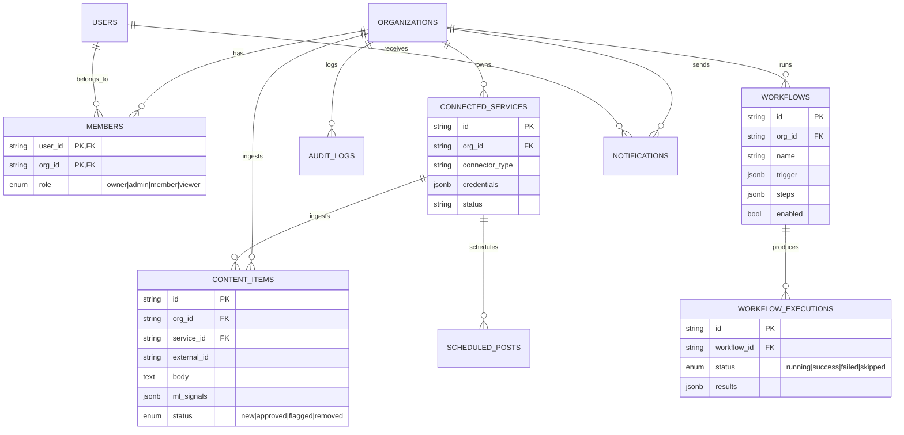

### Migrations

| Migration | Scope |
|-----------|-------|
| `001_initial` | Core tables (users, orgs, members) |
| `002_phase1` | Connector + service tables |
| `003_phase4` | ML signals on content |
| `004_phase_a` | Phase A foundation additions |
| `005_phase_d` | Phase D additions |
| `006_phase_e` | Phase E additions |
| `007_phase_f` | Phase F additions |
| `008_phase_g` | Phase G additions |
| `009_phase_l` | Phase L — billing, invites, K8s support |
| `010_audit_fixes` | Audit gap fixes |
| `011_workflows` | Workflow + execution tables |
| `012_indexes` | Performance indexes |

### Key Tables

| Table | Purpose |
|-------|---------|
| `organizations` | Tenants (orgs) |
| `users` | Platform accounts |
| `members` | Org membership + RBAC role |
| `connected_services` | Per-org connected connectors + encrypted credentials |
| `content_items` | Ingested content with ML signals |
| `workflows` | Workflow definitions (JSONB trigger + steps) |
| `workflow_executions` | Per-run execution log |
| `notifications` | In-app inbox |
| `audit_logs` | Immutable audit trail (RLS-protected) |
| `billing_*` | Subscriptions & invoices (Stripe) |
| `plugins` | Marketplace plugins + runtime metadata |
| `scheduled_posts` | Content calendar |

All tenant data is isolated by **Row-Level Security** — every query is scoped to the authenticated org.

---

## Deployment

### Docker Compose (single host)

```bash
docker compose up -d --build
```

Services: `postgres`, `redis`, `migrate`, `backend`, `frontend`. Health checks gate startup order.

Compose `depends_on` graph:

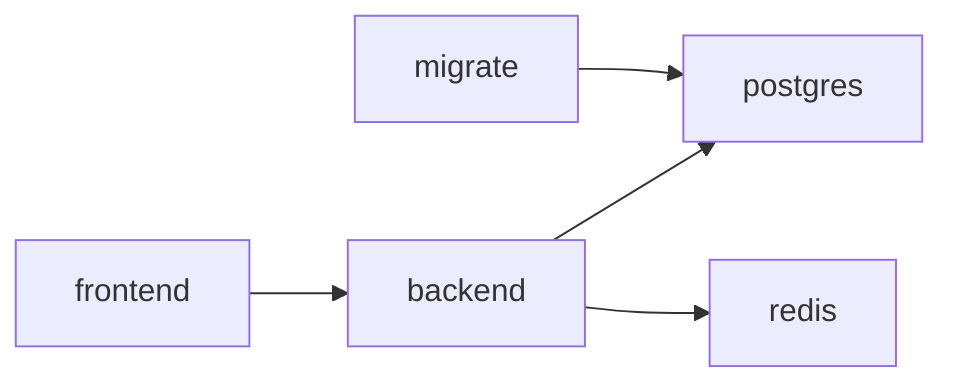

### Kubernetes (Helm)

A Helm chart is provided in `k8s/`:

```bash
helm upgrade --install media-basket ./k8s \
  --set postgres.password=YOUR_PASSWORD \
  --set jwtSecret=CHANGE_ME
```

### Backup / Restore

```bash
./backup.sh          # one-command dump
./restore.sh         # one-command restore
```

---

## Testing

### Backend (pytest)

```bash
cd backend
pytest
```

Test suites cover auth, orgs, RBAC, connectors, ML signals, workflows, and multi-tenant isolation.

### Frontend E2E (Playwright)

```bash
cd frontend
npm run test:e2e          # headless run
npm run test:e2e:ui       # interactive UI
npm run test:e2e:debug    # step-through debug
npm run test:e2e:report   # open HTML report
```

### Test Pyramid

```mermaid
flowchart TB
    subgraph E2E[Playwright - few]
        E2E1[Signup → connect → moderate]
        E2E2[Workflow run end-to-end]
    end
    subgraph API[Backend integration - many]
        API1[pytest + Postgres]
        API2[RLS isolation tests]
        API3[RBAC matrix tests]
    end
    subgraph UNIT[Unit - most]
        UNIT1[Connector parsing]
        UNIT2[ML score computation]
        UNIT3[Schema validation]
    end
    UNIT --> API
    API --> E2E
```

---

## CI/CD

GitHub Actions workflow (`.github/workflows/`) runs on Linux runners:

```mermaid
flowchart LR
    PUSH[push / PR] --> LINT[Lint + Typecheck]
    LINT --> TEST_B[Backend tests<br/>pytest + Postgres]
    TEST_B --> TEST_E2E[Playwright E2E]
    TEST_E2E --> BUILD[Build images]
    BUILD --> DOCS[Generate docs]
```

See [`CI_CD_SETUP.md`](CI_CD_SETUP.md) for details.

---

## Troubleshooting

| Symptom | Likely Cause | Fix |
|---------|--------------|-----|
| Frontend loads but API fails | CORS / wrong `NEXT_PUBLIC_API_URL` | Set `CORS_ORIGINS` and API URL in `.env` |
| `databases not found` on startup | Migrations not run | `docker compose up migrate` or `alembic upgrade head` |
| Auth fails in production | Default `JWT_SECRET_KEY` | Set a strong secret, restart |
| Connector shows "no content" | Credentials not connected / no OAuth | Re-run OAuth in **Settings → Services** |
| WebSocket events missing | Redis not reachable | Check `REDIS_URL`, restart Redis |
| High API latency | Missing indexes | Run migration `012_indexes` |
| `/docs` 404 | `DEBUG=false` | Docs intentionally disabled in production |
| Rate limit errors | Too many requests | Adjust `rate_limiter.py` thresholds |
| Slow queue | Celery workers not scaled | Add workers / set concurrency |

---

## Contributing

**Important — read the license first.**

Media Basket is proprietary software, © 2024-2026 SowinySoft, all rights reserved. By default **no permission is granted** to use, copy, modify, or distribute the software.

**Pull requests require EXPLICIT WRITTEN PERMISSION** from the author before submission. This applies to bug fixes, feature additions, documentation changes, translations, refactoring, and performance improvements. Unauthorized pull requests will be closed without review.

To request permission:

- GitHub: https://github.com/SowinySoft
- Email: `SowinySoft@gmail.com` (subject: *"Media Basket License Request"*)
- Wait for explicit written approval **before** creating the PR

### Permitted without permission

- Viewing the source for personal, non-commercial educational purposes
- Forking the repo for personal study (not redistribution)
- Reporting issues / bugs via GitHub Issues
- Suggesting features via GitHub Discussions

### Prohibited without permission

- Commercial use of any kind
- Redistribution (modified or unmodified)
- Derivative works
- Hosting as a service for third parties
- Selling / licensing to third parties

---

## Roadmap

See [`ROADMAP.md`](ROADMAP.md) for the detailed implementation plan. Current shipped milestones:

| Milestone | Status |
|-----------|--------|
| Phase A–I: SaaS foundation, connectors, ML, hardening | ✅ |
| Phase J: Connector completion (15/15) | ✅ |
| Phase K: Frontend polish — dashboard, content detail, mobile nav | ✅ |
| Phase L: SaaS launch — Stripe, invites, multi-org, K8s Helm | ✅ |
| Phase M: Plugin marketplace + sandbox + Python SDK | ✅ |
| Phase N: Workflow automation engine + visual builder | ✅ |
| Phase P: Product evaluation fixes (security, performance, quality) | ✅ |
| Playwright E2E suite + CI/CD pipeline | ✅ |

Upcoming (see `realistic_next_pathway.md` and `upcoming_features_roadmap.md`):

- Advanced analytics & bulk moderation
- GPU ML with fine-tuned models
- Community plugin marketplace
- Full multi-org switcher UX
- Horizontal scaling (Celery workers, read replicas)

---

## Documentation

| Document | Description |
|----------|-------------|
| [`ARCHITECTURE.md`](ARCHITECTURE.md) | Full system design — architecture, data model, security |
| [`ROADMAP.md`](ROADMAP.md) | Implementation plan & milestones |
| [`AGENT.md`](AGENT.md) | Project context / agent memory |
| [`workflow.md`](workflow.md) | Workflow automation deep-dive |
| [`EVALUATION.md`](EVALUATION.md) | Product evaluation report |
| [`Audit_Gap_Analysis.md`](Audit_Gap_Analysis.md) | Security & quality gap analysis |
| [`realistic_next_pathway.md`](realistic_next_pathway.md) | Next-step pathway |
| [`CI_CD_SETUP.md`](CI_CD_SETUP.md) | CI/CD pipeline setup |

---

## License

**PROPRIETARY — ALL RIGHTS RESERVED**

Copyright © 2024-2026 **SowinySoft** (Sowinyar). All rights reserved.

Media Basket is **not** open source. No license is granted to use, copy, modify, merge, publish, distribute, sublicense, or sell the software without the **explicit written permission** of the copyright holder.

- **License:** see [LICENSE](LICENSE)
- **Copyright notice:** see [COPYRIGHT](COPYRIGHT)

For permission requests:
- GitHub: https://github.com/SowinySoft
- Email: `SowinySoft@gmail.com`

---

*Media Basket — All your media accounts in one basket.*
