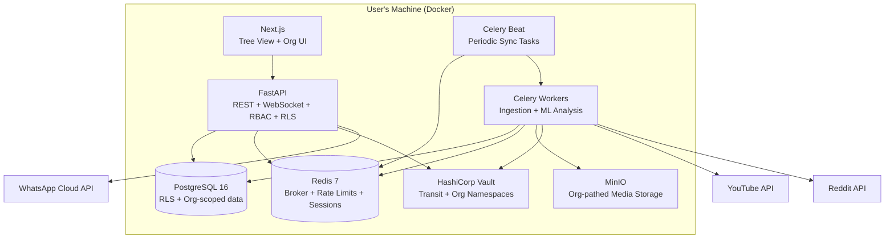
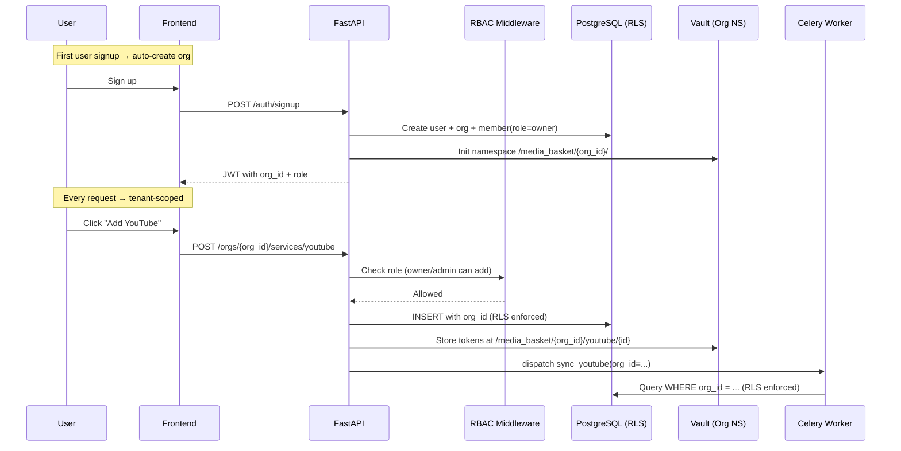
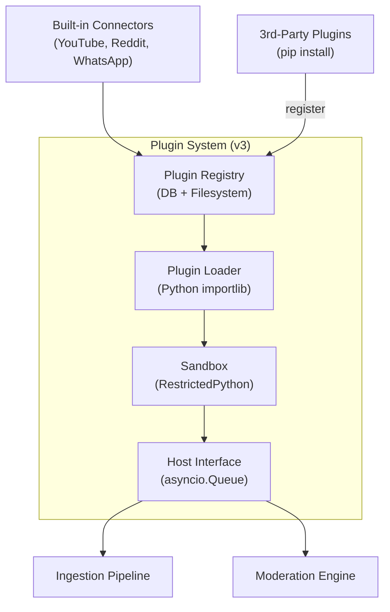

# Media_Basket — Roadmap v1 (SaaS-Ready, Self-Hosted)

> **Goal:** Ship a working product in 10 weeks, built as SaaS-ready from day one — multi-user, org model, RBAC, RLS, billing placeholders, tenant isolation — deployed self-hosted for a single user. Flip a switch later and it's multi-tenant.
> **Strategy:** Self-hosted Docker → 3 connectors → ML pipeline → SaaS plumbing in place → ready to scale.

---

## Core Principle: SaaS From Day One

v1 is **not** "build a single-user app then add SaaS later." v1 is "build the SaaS system, deploy it for one user." Every table has `org_id`. Every query is tenant-scoped. RBAC exists. Billing endpoints exist. The system works for one user today and ten thousand tomorrow — same codebase, same Docker image.

```
v1 (Self-Hosted Single User)     →     v2 (Multi-Tenant SaaS)
──────────────────────────              ──────────────────────
One org (auto-created)                 Many orgs
One user (admin)                       Many users per org
RBAC enforced (trivially)              RBAC enforced (meaningfully)
RLS active (one tenant)                RLS active (thousands of tenants)
Billing endpoints exist (no Stripe)    Billing endpoints wired to Stripe
Vault namespace: /media_basket/        Vault namespace: /media_basket/{org_id}/
Rate limits: org-level (one org)       Rate limits: org-level (many orgs)
```

**What changes to go multi-tenant:** Add Stripe webhook handler, add invite email flow, add org switcher UI. That's it. The data model, RLS, RBAC, Vault isolation — all already there.

---

## Tech Stack (v1 — SaaS-Ready)

| Layer | Technology | Why |
|-------|-----------|-----|
| **Frontend** | Next.js 14+ (App Router) + React 18 + TypeScript | Server components, tree rendering, RSC |
| **Tree View** | `react-arborist` | Virtualized Windows-Explorer-style tree |
| **UI Kit** | Tailwind CSS + Radix UI | Accessible, composable |
| **Backend API** | FastAPI (Python 3.12+) | Async, auto OpenAPI docs, Pydantic validation |
| **Auth** | NextAuth.js → FastAPI JWT bridge | OAuth SSO + session management |
| **ORM** | SQLAlchemy 2.0 (async) | Mature, Alembic migrations, battle-tested |
| **Database** | PostgreSQL 16 | JSONB, Row-Level Security |
| **Queue** | Celery 5 + Redis broker | Ingestion jobs, retry, periodic tasks via Beat |
| **Cache** | Redis 7 | Sessions, rate limits, pub/sub |
| **ML Pipeline** | scikit-learn + spaCy + HuggingFace | Sentiment, spam detection, auto-tagging |
| **ML Serving** | FastAPI + ONNX Runtime | Low-latency inference |
| **Secrets** | HashiCorp Vault (dev mode) | Transit engine, per-org namespaces |
| **Storage** | MinIO (local S3) | Media attachments, backups |
| **Logging** | Python `structlog` → Loki | Structured JSON, correlation IDs |
| **Monitoring** | OpenTelemetry + Prometheus + Grafana | Traces, metrics, dashboards |

---

## Guiding Principles

1. **SaaS-ready from day one** — multi-user, org, RBAC, RLS, billing placeholders built in
2. **Self-hosted first** — Docker Compose, one user, zero cloud dependency
3. **3 connectors** — YouTube, Reddit, WhatsApp Business
4. **Tree view as the core UX** — Windows Explorer metaphor, the novel differentiator
5. **ML-powered moderation** — sentiment, spam, toxicity, auto-tagging from day one
6. **Flip a switch = multi-tenant** — same codebase, same image, just add users
7. **Validate the tree-view metaphor** — if users love the UX, everything else follows

---

## What v1 IS (SaaS-Ready)

| SaaS Component | v1 Status | Detail |
|----------------|-----------|--------|
| Multi-user auth | ✅ Built | Signup, login, password reset, OAuth SSO |
| Organization model | ✅ Built | Auto-create org on first user, invite members |
| RBAC | ✅ Built | Owner / Admin / Member / Viewer roles |
| Row-Level Security | ✅ Active | `org_id` on all tables, PostgreSQL RLS policies |
| Billing endpoints | ✅ Placeholder | `/api/v1/billing/plan`, `/api/v1/billing/usage` — no Stripe yet |
| Rate limiting | ✅ Per-org | Token bucket in Redis, org-scoped |
| Vault namespaces | ✅ Built | `/media_basket/{org_id}/` per tenant |
| Audit logging | ✅ Active | Append-only `audit_log` table, tenant-scoped |
| Tenant provisioning | ✅ Placeholder | Onboarding flow exists, invite email skipped (no SMTP) |
| Data export (GDPR) | ✅ Built | Per-org export, delete account |
| Backup/restore | ✅ Built | Shell scripts, PostgreSQL dump + Vault snapshot |

---

## What v1 Is NOT (Yet)

- ❌ Not 9 connectors (only 3)
- ❌ Not a plugin SDK
- ❌ Not SOC 2 compliant
- ❌ Not horizontally scaled (single Docker Compose)
- ❌ No Stripe billing (endpoints exist, no payment integration)
- ❌ No email service (invites/notifications skip email delivery)
- ❌ No hosted deployment (self-hosted only)

---

## Non-Functional Requirements (SaaS-Complete)

| ID | Requirement | v1 Target | v2 SaaS Target |
|----|-------------|-----------|----------------|
| NFR-01 | API response time (p95) | < 200ms | < 200ms |
| NFR-02 | Ingestion latency (event → DB) | < 5s | < 5s |
| NFR-03 | Availability | Best effort (self-hosted) | 99.9% |
| NFR-04 | Data retention | Configurable per org (default 90 days) | Configurable per plan |
| NFR-05 | Concurrent users | 1 (self-hosted) | 10K+ per tenant cluster |
| NFR-06 | Plugin isolation | N/A (no plugins yet) | Zero shared state with host |
| NFR-07 | Encryption at rest | AES-256-GCM (Vault Transit) | AES-256-GCM (Vault Transit) |
| NFR-08 | Encryption in transit | TLS 1.3 (self-signed for local) | TLS 1.3 (managed cert) |
| NFR-09 | SOC 2 readiness | ❌ Not applicable | Phase 2 — access reviews, audit logs, encryption verification |
| NFR-10 | GDPR compliance | ✅ Built — export + delete account | ✅ Built — right to deletion, data portability, consent management |
| NFR-11 | Data residency | Single region (user's machine) | Configurable per org |
| NFR-12 | Backup frequency | Manual (`./backup.sh`) | Automated daily + on-demand |
| NFR-13 | Recovery time | Manual restore (`./restore.sh`) | < 1 hour RTO |
| NFR-14 | Rate limiting | Per-org, configurable | Per-org, per-plan tiers |

### GDPR Compliance (Built-In v1)

| Requirement | Implementation |
|-------------|---------------|
| Right to access | `GET /api/v1/export?format=json` — all org data as JSON |
| Right to erasure | `DELETE /api/v1/org` — wipe data + vault + revoke tokens |
| Right to portability | JSON export, importable in future versions |
| Data minimization | Only collect what's needed for service integration |
| Consent | OAuth consent flows, clear data usage in settings |
| Audit trail | Append-only `audit_log` — who did what, when |

### SOC 2 Readiness (v2 Placeholder)

| Control | v1 Status | v2 Implementation |
|---------|-----------|-------------------|
| Access reviews | RBAC enforced, but no periodic review | Quarterly access reviews |
| Audit logging | ✅ Built — append-only audit_log | + log retention policy |
| Encryption verification | ✅ Vault Transit | + key rotation schedule |
| Incident response | Manual | Automated alerts + runbook |
| Vendor management | N/A (self-hosted) | Third-party API risk assessments |
| Change management | Git-based | + PR reviews, staging environment |

---

## Tree View Structure

```
┌─────────────────────────────────────────────────────────┐
│ 🌳 My Basket                                            │
├─────────────────────────────────────────────────────────┤
│ ▼ 📺 YouTube                          🟢 Connected  12  │
│   ▼ 📹 Videos                                           │
│     📄 "How to Build a REST API"              2d ago   │
│   ▼ 💬 Comments                                         │
│     💬 "Great video!" — @user123         😊 1h ago    │
│     💬 "Need more examples" — @devgirl   😐 3h ago    │
│   📊 Analytics                                          │
│ ▼ 🔷 Reddit                           🟢 Connected   3  │
│   ▼ 📝 Posts                                            │
│   ▼ 💬 Comments                                         │
│     💬 "Nice work, what DB?"            🚩 2h ago    │
│   🛡️ Mod Queue                                    2    │
│ ▼ 💬 WhatsApp Business                🟢 Connected   7  │
│   ▼ 💬 Conversations                                    │
│     👤 John Doe — "Hey, are you free?"          2m ago │
│ ➕ Add Service...                                       │
└─────────────────────────────────────────────────────────┘
```

---

## Phase 0: SaaS Foundation (Weeks 1–3)

**Goal:** Multi-user, org model, RBAC, RLS, Vault namespaces, auth — all working for one user.

### 0A: Database & Auth (Week 1)

| Task | Detail |
|------|--------|
| Monorepo setup | `backend/` (FastAPI) + `frontend/` (Next.js) + `ml/` (pipeline) |
| PostgreSQL + Redis + Vault | Docker Compose with all services |
| **Organization model** | `organizations` table — auto-created for first user |
| **User model** | `users` table — email, name, auth provider |
| **Member model** | `members` table — links user to org with role |
| **RBAC middleware** | FastAPI dependency: check role before action |
| **Row-Level Security** | Add `org_id` to ALL tables, enable RLS policies |
| **Vault namespaces** | `/media_basket/{org_id}/` — credential isolation |
| Alembic setup | Initial migration with all SaaS tables |

### 0B: Frontend & Tree (Week 2)

| Task | Detail |
|------|--------|
| Next.js skeleton | Login, signup, forgot password pages |
| **Org auto-creation** | First user → auto-create org → become Owner |
| Tree-view component | `react-arborist`, mock data, expand/collapse |
| Node types | Service nodes, category nodes, content nodes |
| Node badges | Unread counts |
| Context menus | Right-click actions |
| Dashboard shell | Health check placeholders |

### 0C: SaaS Plumbing (Week 3)

| Task | Detail |
|------|--------|
| **Billing endpoints** | `GET /billing/plan`, `POST /billing/upgrade`, `GET /billing/usage` |
| **Rate limiting** | Redis token bucket, per-org, configurable per plan |
| **Audit logging** | Append-only `audit_log` table, every mutation logged |
| **Data export** | `GET /export?format=json` — all org data as JSON |
| **Delete account** | `DELETE /org` — wipe data + vault + revoke tokens |
| **Backup script** | `./backup.sh` — PostgreSQL dump + Vault snapshot |
| **Restore script** | `./restore.sh <file>` |
| Health check dashboard | `/dashboard` — service status, ML health, Vault status |
| Docker Compose | `docker compose up` runs everything |

**Deliverable:** `docker compose up` → signup → auto-org created → tree view with mock data → all SaaS infrastructure active.

---

## Phase 1: YouTube Connector (Weeks 4–5)

**Goal:** Full YouTube integration — OAuth, sync, tree node, content view.

| Task | Detail |
|------|--------|
| YouTube OAuth flow | Google Cloud Console, OAuth consent screen, token exchange |
| **Credential storage (Vault)** | `/media_basket/{org_id}/youtube/{service_id}` |
| Celery sync task | `sync_youtube` — fetch channel, videos, comments |
| Normalizer | YouTube API → unified content schema (Pydantic) |
| **Tenant-scoped sync** | Task receives `org_id`, queries only that org's data |
| Service node | YouTube node in tree, status indicator |
| Category nodes | Videos, Comments, Analytics |
| Content nodes | Individual videos and comments |
| Comment moderation | Right-click → approve/delete/flag |
| Real-time updates | WebSocket with `org_id` filter |
| **RLS verification** | Confirm queries are tenant-scoped |

**Deliverable:** Connect YouTube → tree populates → moderate from tree → all data org-scoped.

---

## Phase 2: Reddit Connector (Weeks 5–7)

**Goal:** Reddit integration — proves connector pattern, confirms multi-tenant works.

| Task | Detail |
|------|--------|
| Reddit OAuth flow | Reddit app registration, OAuth2 code flow |
| Credential storage | Same Vault pattern, org-namespaced |
| Celery sync task | `sync_reddit` — posts, comments, mod queue |
| Normalizer | Reddit API → unified content schema |
| Service node | Reddit node alongside YouTube |
| Category nodes | Posts, Comments, Mod Queue |
| Moderation actions | Right-click → approve/remove/comment |
| Rate limit compliance | 60 req/min, per-org token bucket |
| **Cross-org isolation test** | Confirm User A can't see User B's data |

**Deliverable:** Two service nodes, both working, org-isolation verified.

---

## Phase 3: WhatsApp Connector (Weeks 7–8)

**Goal:** WhatsApp Business — messaging, webhooks, signature verification.

| Task | Detail |
|------|--------|
| WhatsApp Cloud API setup | Meta Business account, phone number, permanent token |
| Credential storage | Vault, org-namespaced |
| Celery sync task | `sync_whatsapp` — conversations, messages, media |
| Service node | WhatsApp node with conversation badge |
| Category nodes | Conversations, Templates |
| Reply support | Send messages via API |
| Media handling | Receive images/docs, store in MinIO (org-path) |
| **Webhook receiver** | FastAPI endpoint with HMAC-SHA256 verification |
| **Webhook routing** | Verify signature → extract org_id from URL path → dispatch |

**Deliverable:** Three services, webhooks secured, org-isolation confirmed.

---

## Phase 4: ML Pipeline (Weeks 8–9)

**Goal:** Smart moderation — sentiment, spam, toxicity, auto-tagging. Org-scoped.

| Component | Model | Purpose |
|-----------|-------|---------|
| Sentiment | VADER / DistilBERT | Positive/neutral/negative |
| Spam | TF-IDF + Logistic Regression | Flag spam/scam |
| Toxicity | Toxic-BERT (optional) | Flag toxic content |
| Auto-Tagger | spaCy NER | Topic categorization |
| Language | fasttext | Language detection |

| Task | Detail |
|------|--------|
| ML Celery worker | `analyze_content` — receives `org_id`, stores in org-scoped metadata |
| ML results | `content_metadata` table — org-scoped via parent FK |
| Auto-flagging | Spam/toxicity > threshold → moderation queue (org-scoped) |
| WebSocket ML events | `content.flagged` with `org_id` filter |
| ML settings | Per-org toggle, threshold sliders |

**Deliverable:** ML moderation running, results org-scoped, auto-flagging works.

---

## Phase 5: Polish & Ship (Weeks 9–10)

**Goal:** Docker image, documentation, self-hosted ready, SaaS-complete.

| Task | Detail |
|------|--------|
| Dockerfile | Multi-stage build |
| README.md | Setup guide, OAuth walkthroughs, SaaS architecture docs |
| Settings page | Credentials, ML toggles, org settings, billing info |
| RBAC UI | Org settings → members → role management |
| Tree polish | Search (Ctrl+F), keyboard nav, smooth animations |
| Dark mode | Tailwind dark mode toggle |
| Rate limit dashboard | Per-org API consumption display |
| Error handling | Graceful failures, token expiry, DLQ viewer |
| **SaaS toggle** | `SAAS_MODE=true` env var — enables invite flow, org switcher |
| GitHub repo | Public, MIT license, issue templates |

**Deliverable:** `git clone` → `docker compose up` → working SaaS-ready Media_Basket.

---

## v1 Data Model (SaaS-Ready)

```python
# All tables include org_id for Row-Level Security

class Organization(Base):
    __tablename__ = "organizations"
    id: Mapped[UUID] = mapped_column(primary_key=True, default=uuid4)
    name: Mapped[str]
    slug: Mapped[str] = mapped_column(unique=True)
    plan: Mapped[str] = mapped_column(default="free")  # free | pro | enterprise
    settings: Mapped[dict] = mapped_column(JSONB, default={})
    created_at: Mapped[datetime] = mapped_column(default=func.now())

class User(Base):
    __tablename__ = "users"
    id: Mapped[UUID] = mapped_column(primary_key=True, default=uuid4)
    email: Mapped[str] = mapped_column(unique=True)
    name: Mapped[str]
    avatar_url: Mapped[Optional[str]]
    auth_provider: Mapped[str]  # "email" | "google" | "github"
    settings: Mapped[dict] = mapped_column(JSONB, default={})
    created_at: Mapped[datetime] = mapped_column(default=func.now())

class Member(Base):
    __tablename__ = "members"
    id: Mapped[UUID] = mapped_column(primary_key=True, default=uuid4)
    org_id: Mapped[UUID] = mapped_column(ForeignKey("organizations.id"))
    user_id: Mapped[UUID] = mapped_column(ForeignKey("users.id"))
    role: Mapped[str]  # "owner" | "admin" | "member" | "viewer"
    joined_at: Mapped[datetime] = mapped_column(default=func.now())
    __table_args__ = (UniqueConstraint('org_id', 'user_id'),)

class ServiceInstance(Base):
    __tablename__ = "service_instances"
    id: Mapped[UUID] = mapped_column(primary_key=True, default=uuid4)
    org_id: Mapped[UUID] = mapped_column(ForeignKey("organizations.id"))
    created_by: Mapped[UUID] = mapped_column(ForeignKey("members.id"))
    connector_type: Mapped[str]  # "youtube" | "reddit" | "whatsapp"
    display_name: Mapped[str]
    config: Mapped[dict] = mapped_column(JSONB, default={})
    status: Mapped[str]  # "active" | "expired" | "error"
    last_synced_at: Mapped[Optional[datetime]]
    created_at: Mapped[datetime] = mapped_column(default=func.now())

class CredentialVault(Base):
    __tablename__ = "credential_vault"
    id: Mapped[UUID] = mapped_column(primary_key=True, default=uuid4)
    org_id: Mapped[UUID] = mapped_column(ForeignKey("organizations.id"))
    service_instance_id: Mapped[UUID] = mapped_column(ForeignKey("service_instances.id"))
    vault_path: Mapped[str]  # /media_basket/{org_id}/{service_id}
    key_version: Mapped[int] = mapped_column(default=1)
    rotated_at: Mapped[datetime] = mapped_column(default=func.now())

class ContentItem(Base):
    __tablename__ = "content_items"
    id: Mapped[UUID] = mapped_column(primary_key=True, default=uuid4)
    org_id: Mapped[UUID] = mapped_column(ForeignKey("organizations.id"))
    service_instance_id: Mapped[UUID] = mapped_column(ForeignKey("service_instances.id"))
    external_id: Mapped[str]
    content_type: Mapped[str]
    category: Mapped[str]
    payload: Mapped[dict] = mapped_column(JSONB)
    content_hash: Mapped[str]
    ingested_at: Mapped[datetime] = mapped_column(default=func.now())
    updated_at: Mapped[datetime] = mapped_column(default=func.now(), onupdate=func.now())

class ContentMetadata(Base):
    __tablename__ = "content_metadata"
    id: Mapped[UUID] = mapped_column(primary_key=True, default=uuid4)
    org_id: Mapped[UUID] = mapped_column(ForeignKey("organizations.id"))
    content_item_id: Mapped[UUID] = mapped_column(ForeignKey("content_items.id"))
    sentiment: Mapped[Optional[str]]
    sentiment_score: Mapped[Optional[float]]
    spam_score: Mapped[Optional[float]]
    toxicity_score: Mapped[Optional[float]]
    auto_tags: Mapped[Optional[list]] = mapped_column(JSONB)
    language: Mapped[Optional[str]]
    flagged: Mapped[bool] = mapped_column(default=False)
    flag_reasons: Mapped[Optional[list]] = mapped_column(JSONB)
    analyzed_at: Mapped[datetime] = mapped_column(default=func.now())

class ModerationAction(Base):
    __tablename__ = "moderation_actions"
    id: Mapped[UUID] = mapped_column(primary_key=True, default=uuid4)
    org_id: Mapped[UUID] = mapped_column(ForeignKey("organizations.id"))
    service_instance_id: Mapped[UUID] = mapped_column(ForeignKey("service_instances.id"))
    member_id: Mapped[UUID] = mapped_column(ForeignKey("members.id"))
    content_item_id: Mapped[UUID] = mapped_column(ForeignKey("content_items.id"))
    action: Mapped[str]
    details: Mapped[Optional[dict]] = mapped_column(JSONB)
    performed_at: Mapped[datetime] = mapped_column(default=func.now())

class AuditLog(Base):
    __tablename__ = "audit_log"
    id: Mapped[UUID] = mapped_column(primary_key=True, default=uuid4)
    org_id: Mapped[UUID] = mapped_column(ForeignKey("organizations.id"))
    member_id: Mapped[Optional[UUID]] = mapped_column(ForeignKey("members.id"))
    action: Mapped[str]  # "service.created", "credential.rotated", etc.
    resource_type: Mapped[str]
    resource_id: Mapped[Optional[UUID]]
    details: Mapped[Optional[dict]] = mapped_column(JSONB)
    ip_address: Mapped[Optional[str]]
    user_agent: Mapped[Optional[str]]
    timestamp: Mapped[datetime] = mapped_column(default=func.now())

class BillingPlan(Base):
    __tablename__ = "billing_plans"
    id: Mapped[UUID] = mapped_column(primary_key=True, default=uuid4)
    org_id: Mapped[UUID] = mapped_column(ForeignKey("organizations.id"), unique=True)
    plan: Mapped[str] = mapped_column(default="free")  # free | pro | enterprise
    max_services: Mapped[int] = mapped_column(default=3)
    max_members: Mapped[int] = mapped_column(default=1)
    max_ml_analyses: Mapped[int] = mapped_column(default=1000)
    stripe_customer_id: Mapped[Optional[str]]
    stripe_subscription_id: Mapped[Optional[str]]
    current_period_end: Mapped[Optional[datetime]]
    created_at: Mapped[datetime] = mapped_column(default=func.now())
```

### Row-Level Security (PostgreSQL)

```sql
-- Every query is scoped to org_id
-- Application sets: SET LOCAL app.current_tenant = '<org-uuid>';

CREATE POLICY org_isolation ON service_instances
    USING (org_id = current_setting('app.current_tenant')::UUID);

CREATE POLICY org_isolation ON content_items
    USING (org_id = current_setting('app.current_tenant')::UUID);

CREATE POLICY org_isolation ON content_metadata
    USING (org_id = current_setting('app.current_tenant')::UUID);

-- Apply same pattern to ALL org-scoped tables
```

---

## v1 Architecture (SaaS-Ready)





---

## v1 Feature Matrix

| Feature | YouTube | Reddit | WhatsApp | Notes |
|---------|---------|--------|----------|-------|
| OAuth connection | ✅ | ✅ | ✅ | |
| Service node | ✅ | ✅ | ✅ | With status indicator |
| Category nodes | ✅ | ✅ | ✅ | Auto-populated |
| Content nodes | ✅ | ✅ | ✅ | Individual items |
| Content sync | ✅ | ✅ | ✅ | Celery, org-scoped |
| Comment moderation | ✅ | ✅ | ❌ | WA uses replies |
| Message reply | ❌ | ❌ | ✅ | WhatsApp only |
| Real-time updates | ✅ | ✅ | ✅ | WebSocket, org-filtered |
| Webhook support | ❌ | ❌ | ✅ | With HMAC verification |
| Credential management | ✅ | ✅ | ✅ | Vault, org-namespaced |
| Node badges | ✅ | ✅ | ✅ | Unread counts |
| Context menus | ✅ | ✅ | ✅ | RBAC-gated |
| ML sentiment | ✅ | ✅ | ✅ | 😊😐☹️ |
| ML spam detection | ✅ | ✅ | ✅ | 🚩 auto-flagged |
| ML auto-tagging | ✅ | ✅ | ❌ | Topic categorization |
| Write content | ❌ | ❌ | ✅ | WhatsApp replies |

### SaaS Features (Built-In)

| Feature | v1 Status | Detail |
|---------|-----------|--------|
| Multi-user signup | ✅ Working | Email + OAuth (Google, GitHub) |
| Organization auto-creation | ✅ Working | First user becomes Owner |
| RBAC | ✅ Active | Owner/Admin/Member/Viewer |
| Row-Level Security | ✅ Active | All queries tenant-scoped |
| Billing endpoints | ✅ Placeholder | Ready for Stripe wiring |
| Rate limiting | ✅ Per-org | Token bucket, configurable per plan |
| Vault namespaces | ✅ Built | Org-isolated credential storage |
| Audit logging | ✅ Active | Every mutation logged |
| Data export | ✅ Working | JSON export per org |
| Delete account | ✅ Working | Wipe org data + vault |
| Backup/restore | ✅ Working | Shell scripts |
| Health dashboard | ✅ Working | Service status, ML health, Vault |
| Tree search | ✅ Working | Ctrl+F |
| Dark mode | ✅ Working | Tailwind toggle |

---

## v1 Connector Scope — YouTube

> **Implements:** `ConnectorPlugin` ABC — SDK contract enforced

| Capability | Detail |
|------------|--------|
| **Auth** | OAuth 2.0 (Google Cloud Console) |
| **Scopes** | `youtube.readonly`, `youtube.force-ssl` |
| **Sync** | Channel info, videos, comments |
| **Moderation** | Approve/flag/delete comments |
| **Rate Limit** | 10,000 units/day |
| **Poll** | Every 5 min (Celery Beat) |
| **Vault Path** | `/media_basket/{org_id}/youtube/{service_id}` |
| **Tier** | Full |
| **Webhooks** | Supported (Pub/Sub) |

```python
# connectors/youtube.py

@dataclass
class YouTubeManifest(ConnectorManifest):
    name: str = "youtube"
    display_name: str = "YouTube"
    version: str = "1.0.0"
    tier: str = "full"
    icon: str = "youtube.svg"
    capabilities: dict = field(default_factory=lambda: {
        "reads": ["videos", "comments", "analytics"],
        "writes": ["comments"],
        "webhooks": True,
        "poll_interval": "5m"
    })
    auth: dict = field(default_factory=lambda: {
        "type": "oauth2",
        "scopes": ["youtube.readonly", "youtube.force-ssl"],
        "auth_url": "https://accounts.google.com/o/oauth2/v2/auth",
        "token_url": "https://oauth2.googleapis.com/token"
    })

class YouTubeConnector(ConnectorPlugin):
    manifest = YouTubeManifest()

    async def initialize(self, config: dict) -> None: ...
    async def shutdown(self) -> None: ...
    def get_auth_url(self, state: str) -> str: ...
    async def exchange_code(self, code: str) -> dict: ...
    async def refresh_token(self, refresh_token: str) -> dict: ...
    async def fetch(self, params: dict) -> list[dict]: ...
    async def moderate(self, action: str, content_id: str) -> dict: ...
    async def respond(self, content_id: str, message: str) -> None: ...
    def verify_webhook(self, signature: str, body: bytes) -> bool: ...
    def parse_webhook(self, body: bytes) -> dict: ...
```

---

## v1 Connector Scope — Reddit

> **Implements:** `ConnectorPlugin` ABC — SDK contract enforced

| Capability | Detail |
|------------|--------|
| **Auth** | OAuth 2.0 (script type) |
| **Scopes** | `read`, `submit`, `moderate`, `mysubreddits` |
| **Sync** | Posts, comments, mod queue |
| **Moderation** | Approve/remove/comment |
| **Rate Limit** | 60 req/min |
| **Poll** | Every 5 min (Celery Beat) |
| **Vault Path** | `/media_basket/{org_id}/reddit/{service_id}` |
| **Tier** | Full |
| **Webhooks** | Not supported (poll only) |

```python
# connectors/reddit.py

@dataclass
class RedditManifest(ConnectorManifest):
    name: str = "reddit"
    display_name: str = "Reddit"
    version: str = "1.0.0"
    tier: str = "full"
    icon: str = "reddit.svg"
    capabilities: dict = field(default_factory=lambda: {
        "reads": ["posts", "comments", "mod_queue"],
        "writes": ["comments", "moderation"],
        "webhooks": False,
        "poll_interval": "5m"
    })
    auth: dict = field(default_factory=lambda: {
        "type": "oauth2",
        "scopes": ["read", "submit", "moderate", "mysubreddits"],
        "auth_url": "https://www.reddit.com/api/v1/authorize",
        "token_url": "https://www.reddit.com/api/v1/access_token"
    })

class RedditConnector(ConnectorPlugin):
    manifest = RedditManifest()

    async def initialize(self, config: dict) -> None: ...
    async def shutdown(self) -> None: ...
    def get_auth_url(self, state: str) -> str: ...
    async def exchange_code(self, code: str) -> dict: ...
    async def refresh_token(self, refresh_token: str) -> dict: ...
    async def fetch(self, params: dict) -> list[dict]: ...
    async def moderate(self, action: str, content_id: str) -> dict: ...
    async def respond(self, content_id: str, message: str) -> None: ...
    def verify_webhook(self, signature: str, body: bytes) -> bool: ...
    def parse_webhook(self, body: bytes) -> dict: ...
```

---

## v1 Connector Scope — WhatsApp Business

> **Implements:** `ConnectorPlugin` ABC — SDK contract enforced

| Capability | Detail |
|------------|--------|
| **Auth** | OAuth 2.0 (Meta Business) |
| **Sync** | Conversations, messages, media |
| **Reply** | Send text/template messages |
| **Rate Limit** | 80 msg/sec |
| **Webhooks** | Mandatory, HMAC-SHA256 verified |
| **Poll** | Webhook-driven only |
| **Vault Path** | `/media_basket/{org_id}/whatsapp/{service_id}` |
| **Tier** | Full |

```python
# connectors/whatsapp.py

@dataclass
class WhatsAppManifest(ConnectorManifest):
    name: str = "whatsapp"
    display_name: str = "WhatsApp Business"
    version: str = "1.0.0"
    tier: str = "full"
    icon: str = "whatsapp.svg"
    capabilities: dict = field(default_factory=lambda: {
        "reads": ["conversations", "messages", "media"],
        "writes": ["messages", "templates"],
        "webhooks": True,
        "poll_interval": None  # webhook-driven
    })
    auth: dict = field(default_factory=lambda: {
        "type": "oauth2",
        "scopes": [],
        "auth_url": "https://www.facebook.com/v18.0/dialog/oauth",
        "token_url": "https://graph.facebook.com/v18.0/oauth/access_token"
    })

class WhatsAppConnector(ConnectorPlugin):
    manifest = WhatsAppManifest()

    async def initialize(self, config: dict) -> None: ...
    async def shutdown(self) -> None: ...
    def get_auth_url(self, state: str) -> str: ...
    async def exchange_code(self, code: str) -> dict: ...
    async def refresh_token(self, refresh_token: str) -> dict: ...
    async def fetch(self, params: dict) -> list[dict]: ...
    async def moderate(self, action: str, content_id: str) -> dict: ...
    async def respond(self, content_id: str, message: str) -> None: ...
    def verify_webhook(self, signature: str, body: bytes) -> bool: ...
    def parse_webhook(self, body: bytes) -> dict: ...
```

---

## Connector SDK — Plugin Architecture

> **v1 Status:** Contract defined + 3 built-in connectors implement it. v3 adds dynamic plugin loading.
> **Why:** Prove the contract works with official connectors before opening to third parties.

### SDK Contract (Definition Complete)

```python
# @media-basket/connector-sdk — Python

from abc import ABC, abstractmethod
from dataclasses import dataclass
from typing import Optional

@dataclass
class ConnectorManifest:
    name: str                    # Unique: "youtube"
    display_name: str            # Human: "YouTube"
    version: str                 # Semver
    tier: str                    # "full" | "lightweight"
    icon: str                    # SVG path or URL
    capabilities: dict           # {reads: [...], writes: [...], webhooks: bool}
    auth: dict                   # {type: "oauth2"|"api_token"|"bot_token", scopes: [...]}

class ConnectorPlugin(ABC):
    manifest: ConnectorManifest

    @abstractmethod
    async def initialize(self, config: dict) -> None: ...

    @abstractmethod
    async def shutdown(self) -> None: ...

    @abstractmethod
    def get_auth_url(self, state: str) -> str: ...

    @abstractmethod
    async def exchange_code(self, code: str) -> dict: ...

    @abstractmethod
    async def refresh_token(self, refresh_token: str) -> dict: ...

    @abstractmethod
    async def fetch(self, params: dict) -> list[dict]: ...

    @abstractmethod
    async def moderate(self, action: str, content_id: str) -> dict: ...

    @abstractmethod
    async def respond(self, content_id: str, message: str) -> None: ...

    @abstractmethod
    def verify_webhook(self, signature: str, body: bytes) -> bool: ...

    @abstractmethod
    def parse_webhook(self, body: bytes) -> dict: ...
```

### Plugin Loading (v3)



### Plugin Manifest File

```json
{
  "name": "my-custom-connector",
  "display_name": "My Custom Service",
  "version": "1.0.0",
  "tier": "lightweight",
  "entry": "./connector.py",
  "capabilities": {
    "reads": ["posts", "comments"],
    "writes": [],
    "webhooks": false,
    "poll_interval": "15m"
  },
  "auth": {
    "type": "api_token"
  },
  "permissions": ["network:outbound"]
}
```

### 3rd-Party Plugins (v3 Placeholder)

| Component | v1 Status | v3 Implementation |
|-----------|-----------|-------------------|
| Plugin manifest format | ✅ Defined | JSON validation on load |
| Plugin loader | ❌ Placeholder | `importlib` dynamic loading |
| Plugin sandbox | ❌ Placeholder | `RestrictedPython` or `subprocess` |
| Plugin registry | ❌ Placeholder | DB table + filesystem scan |
| Plugin marketplace UI | ❌ Placeholder | Browse, install, configure |
| Plugin → Host interface | ✅ Defined | `ConnectorPlugin` ABC |
| Capability declaration | ✅ Defined | Reads, writes, webhooks |
| Network isolation | ❌ Placeholder | Allowlist per capability |
| DB access | ❌ Blocked | Plugins cannot access DB directly |

### How to Add a New Connector (v2+)

Adding a new connector (e.g., Meta/Facebook, X/Twitter, Telegram) requires **only** implementing the `ConnectorPlugin` interface:

```python
# Step 1: Define manifest
@dataclass
class FacebookManifest(ConnectorManifest):
    name: str = "facebook"
    display_name: str = "Facebook"
    version: str = "1.0.0"
    tier: str = "full"
    icon: str = "facebook.svg"
    capabilities: dict = field(default_factory=lambda: {
        "reads": ["posts", "comments", "messages", "insights"],
        "writes": ["comments", "posts"],
        "webhooks": True,
        "poll_interval": "5m"
    })
    auth: dict = field(default_factory=lambda: {
        "type": "oauth2",
        "scopes": ["pages_show_list", "pages_manage_posts", "pages_read_engagement"],
        "auth_url": "https://www.facebook.com/v18.0/dialog/oauth",
        "token_url": "https://graph.facebook.com/v18.0/oauth/access_token"
    })

# Step 2: Implement connector
class FacebookConnector(ConnectorPlugin):
    manifest = FacebookManifest()

    async def initialize(self, config: dict) -> None:
        self.graph = GraphAPI(access_token=config["access_token"])

    async def shutdown(self) -> None:
        pass

    def get_auth_url(self, state: str) -> str:
        return f"{self.manifest.auth['auth_url']}?client_id={CLIENT_ID}&redirect_uri={REDIRECT_URI}&state={state}&scope={','.join(self.manifest.auth['scopes'])}"

    async def exchange_code(self, code: str) -> dict:
        # Exchange code for long-lived token
        ...

    async def refresh_token(self, refresh_token: str) -> dict:
        # Facebook tokens don't expire, but handle edge cases
        ...

    async def fetch(self, params: dict) -> list[dict]:
        # Fetch posts, comments, messages from Graph API
        ...

    async def moderate(self, action: str, content_id: str) -> dict:
        # Approve/hide/delete comments via Graph API
        ...

    async def respond(self, content_id: str, message: str) -> None:
        # Reply to comment or message
        ...

    def verify_webhook(self, signature: str, body: bytes) -> bool:
        # Verify X-Hub-Signature-256
        ...

    def parse_webhook(self, body: bytes) -> dict:
        # Parse Graph API webhook payload
        ...

# Step 3: Register (v2 auto-discovery, v3 dynamic loading)
CONNECTOR_REGISTRY.register(FacebookConnector)
```

**Effort to add a new connector:** ~2-4 hours (implement ABC methods) + ~1-2 hours (OAuth app review per platform).

**No changes needed to:**
- Core API
- Database schema
- Ingestion pipeline
- ML pipeline
- Frontend tree rendering
- WebSocket events
- Moderation engine

---

## Success Criteria for v1

| Metric | Target |
|--------|--------|
| Time to first sync | < 2 min after OAuth |
| Tree load time | < 500ms for 100 nodes |
| ML analysis latency | < 200ms per item (CPU) |
| RLS query overhead | < 5ms per query |
| Docker startup | < 45 seconds |
| Org auto-creation | < 1 second on first signup |
| Documentation | README covers SaaS architecture |

---

## Enhancements

| # | Enhancement | Why |
|---|------------|-----|
| 1 | Health dashboard | One screen: services, ML, Vault, Celery status |
| 2 | Tree search (Ctrl+F) | Find nodes in large trees |
| 3 | Retry + DLQ | Visibility into failed tasks |
| 4 | Webhook verification | Prevent spoofed messages |
| 5 | Export data (GDPR) | Users own their data |
| 6 | Backup/restore | One-command disaster recovery |
| 7 | Rate limit dashboard | API quota visibility |
| 8 | Dark mode | Low effort, high satisfaction |

---

## v1 Final Checklist

```
PRE-IMPLEMENTATION CONFIRMATION

Tech Stack:
  [✓] FastAPI (Python 3.12+)
  [✓] SQLAlchemy 2.0 (async) + Alembic
  [✓] PostgreSQL 16 (RLS enabled)
  [✓] Celery 5 + Redis broker
  [✓] Next.js 14 + react-arborist
  [✓] HashiCorp Vault (Transit + org namespaces)
  [✓] MinIO (local S3)
  [✓] scikit-learn + spaCy + HuggingFace

SaaS Infrastructure:
  [✓] Organization model (auto-create)
  [✓] Multi-user auth (signup + OAuth)
  [✓] RBAC (Owner/Admin/Member/Viewer)
  [✓] Row-Level Security (all tables)
  [✓] Billing endpoints (placeholder)
  [✓] Per-org rate limiting
  [✓] Vault org namespaces
  [✓] Audit logging
  [✓] Data export (GDPR)
  [✓] Delete account

Connectors (3):
  [✓] YouTube — OAuth, Celery, moderation, Vault, ConnectorPlugin ABC
  [✓] Reddit — OAuth, Celery, approve/remove, Vault, ConnectorPlugin ABC
  [✓] WhatsApp — OAuth, webhooks, HMAC verify, Vault, ConnectorPlugin ABC
  [✓] All 3 implement ConnectorPlugin interface — ready for v2 connectors

Features:
  [✓] Tree view (Windows Explorer metaphor)
  [✓] Node hierarchy: Service → Category → Content
  [✓] ML sentiment, spam, toxicity, auto-tagging
  [✓] Real-time WebSocket (org-filtered)
  [✓] Health dashboard
  [✓] Tree search
  [✓] DLQ viewer
  [✓] Dark mode
  [✓] Backup/restore

NOT in v1:
  [✗] 9 connectors (only 3)
  [✗] Plugin SDK
  [✗] SOC 2
  [✗] Stripe billing (endpoints exist, no payment)
  [✗] Email delivery (no SMTP)
  [✗] Horizontal scaling (single Docker Compose)

Timeline: 10 weeks
Target: SaaS-ready product, self-hosted, one user, all infrastructure in place
```

---

## Timeline Summary

```
Week 1-3:  SaaS Foundation  → Org, User, Member, RBAC, RLS, Vault, Auth, Billing, Audit
Week 4-5:  YouTube          → Connector, Celery, moderation, Vault namespace
Week 5-7:  Reddit           → Connector, pattern validated, cross-org isolation
Week 7-8:  WhatsApp         → Connector, webhooks, HMAC verification
Week 8-9:  ML Pipeline      → Sentiment, spam, toxicity, org-scoped
Week 9-10: Polish           → Dashboard, search, dark mode, docs, ship

Target: SaaS-ready product in 10 weeks.
```

---

## After v1: Multi-Tenant SaaS Launch

v1 is self-hosted, single-user, SaaS-ready. v2 flips the switch:

```
v2.0 (Month 3):   Stripe billing — wire endpoints, Free/Pro/Enterprise tiers
v2.1 (Month 3):   Invite flow — email invitations, org member onboarding
v2.2 (Month 4):   Org switcher UI — users belong to multiple orgs
v2.3 (Month 4):   Kubernetes deployment — Helm chart, horizontal scaling
v2.4 (Month 5):   Add Meta/Facebook connector
v2.5 (Month 5):   Add X/Twitter connector
v2.6 (Month 6):   Add Telegram Bot connector
v2.7 (Month 6):   Add Instagram connector
v2.8 (Month 7):   Add LinkedIn connector (lightweight)
v2.9 (Month 7):   Add TikTok connector
v3.0 (Month 8):   Plugin SDK — community connectors
v3.1 (Month 9):   Advanced analytics, bulk moderation
v3.2 (Month 10):  GPU ML, fine-tuned models
v4.0 (Month 12):  Full platform with marketplace
```

---

## Architecture Decision Records (ADRs)

### ADR-001: Envelope Encryption via HashiCorp Vault

**Status:** Decided

**Context:** Credentials must be encrypted at rest. Options: (A) App-level AES key, (B) HashiCorp Vault Transit, (C) AWS KMS.

**Decision:** Use HashiCorp Vault Transit engine. DEKs per credential, KEK managed by Vault. Dev mode for local, production mode for SaaS.

**Consequences:** Vault dependency adds one more Docker service. Saves weeks of migration when going multi-tenant. Alternative: AWS KMS for cloud deployments.

### ADR-002: Celery over BullMQ/Redis Queue

**Status:** Decided

**Context:** Need job queue for ingestion workers, retry logic, periodic sync.

**Decision:** Use Celery 5 with Redis broker + Beat scheduler. Python ecosystem native, mature retry/backoff, periodic task scheduling built-in.

**Consequences:** Redis becomes critical path (broker + cache + rate limits). Sufficient for <100K jobs/day. If scaling beyond, consider RabbitMQ or SQS.

### ADR-003: Python/FastAPI over Node.js/NestJS

**Status:** Decided

**Context:** Backend choice. Options: (A) NestJS (TypeScript), (B) FastAPI (Python).

**Decision:** FastAPI. ML pipeline (scikit-learn, spaCy, HuggingFace) is Python-native. SQLAlchemy 2.0 async is mature. Auto-generated OpenAPI docs.

**Consequences:** Frontend stays Next.js (separate process). TypeScript SDK for connectors deferred to v3. Python-first means ML integration is trivial.

### ADR-004: Lightweight vs. Full Integration Tiering

**Status:** Decided

**Context:** Some services (LinkedIn) have severely limited APIs.

**Decision:** Two tiers:
- **Full:** Bidirectional, webhooks, moderation, real-time sync
- **Lightweight:** Read-only polling, no writes, longer intervals

Each connector declares tier in manifest. UI adapts: lightweight nodes show grey icon, no write actions.

**Consequences:** Users get degraded experience on lightweight services. Can be upgraded if API capabilities expand.

### ADR-005: SaaS-Ready From Day One

**Status:** Decided

**Context:** Build single-user then add SaaS, or build SaaS from start?

**Decision:** Build SaaS infrastructure from day one. `org_id` on all tables, RLS active, RBAC enforced, billing endpoints exist. Deploy as single-user self-hosted.

**Consequences:** ~2 extra weeks upfront. Saves 12-16 weeks of migration later. Same codebase, same Docker image — just add users.

### ADR-006: PostgreSQL RLS over Application-Level Filtering

**Status:** Decided

**Context:** Multi-tenant data isolation. Options: (A) `WHERE org_id =` in every query, (B) PostgreSQL Row-Level Security.

**Decision:** PostgreSQL RLS. Database enforces tenant isolation, not application code. Prevents accidental cross-tenant leaks.

**Consequences:** All queries must set `SET LOCAL app.current_tenant`. Slightly more complex setup, but database-level guarantee is worth it.

### ADR-007: Plugin Isolation via Python importlib (v3)

**Status:** Planned

**Context:** Third-party plugins need to execute code. Options: (A) In-process, (B) subprocess, (C) Docker container.

**Decision:** v3 will use Python `importlib` with `RestrictedPython` sandbox. Sufficient for connector plugins. No DB access, network limited to declared capabilities.

**Consequences:** If plugins need stronger isolation, migrate to Docker containers in v4.

---

## Open Questions (Resolved)

| # | Question | Decision | Rationale |
|---|----------|----------|-----------|
| 1 | **Credential storage for self-hosted?** | HashiCorp Vault Transit | Future-proof for SaaS, no migration needed |
| 2 | **Webhook security?** | HMAC-SHA256 signature verification on all inbound webhooks | Prevent spoofing, mandate in SDK contract |
| 3 | **Content retention?** | Configurable per org, default 90 days | Balances storage cost vs. compliance |
| 4 | **WhatsApp personal accounts?** | Not supported — WhatsApp Business Cloud API only | Personal access is TOS-violating |
| 5 | **AI moderation approach?** | In-house ML pipeline (scikit-learn + HuggingFace) | Full control, no external API dependency |
| 6 | **Offline mode?** | Deferred to v3 | Complexity not justified for v1 |
| 7 | **Multi-org per user?** | Yes — org switcher in topbar | SaaS-ready from day one |
| 8 | **Custom domains?** | Deferred to v2+ | Enterprise feature, not needed for self-hosted |
| 9 | **Email service for invites?** | Deferred to v2 — no SMTP in v1 | Self-hosted single-user doesn't need email |
| 10 | **Stripe billing?** | Endpoints exist in v1, wire Stripe in v2 | Payment integration is v2 priority |

---

*End of ROADMAP.md — Media_Basket v1 (SaaS-Ready, Self-Hosted)*
*Python/FastAPI/SQLAlchemy/Celery + ML pipeline + full SaaS plumbing.*
*Complete mirror of ARCHITECTURE.md with v1 scope.*
*Review alongside ARCHITECTURE.md for full system vision.*
